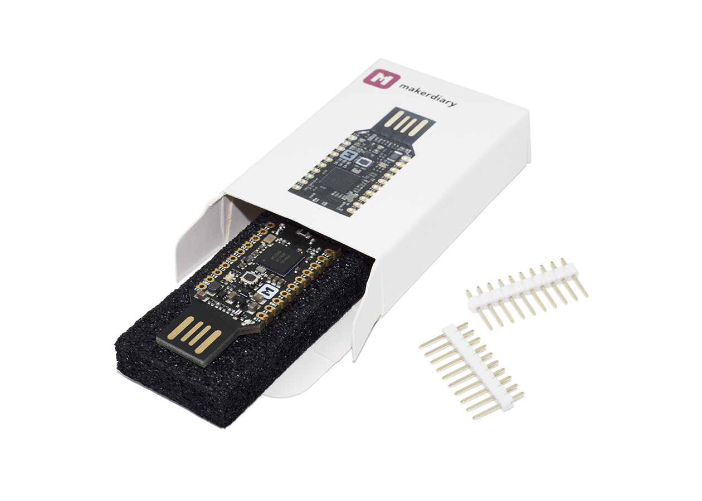

# nRF52840 Micro Dev Kit USB Dongle 

> A small and low-cost nRF52840 Micro Development Kit in USB Dongle Form Factor

## Description

The nRF52840 Micro Dev Kit USB Dongle is a small and low-cost development platform enabled by the nRF52840 multiprotocol SoC in a convenient USB dongle form factor.

The nRF52840 Micro Dev Kit USB Dongle features a programmable user button, RGB LED, up to 12 GPIOs and 2.4G Chip antenna on board.

The USB Dongle can be used as a low-cost Bluetooth5/Tread/802.15.4/ANT/2.4GHz multiprotocol node or development board. Alternatively the USB Dongle can be used as a Network Co-Processor(NCP) with a simple connection to a PC or other USB enabled device.

## Hardware Features

* Nordic nRF52840 System-on-Chip
	- ARM® Cortex®-M4F processor optimized for ultra-low power operation
	- Combining *Bluetooth 5*, *Bluetooth Mesh*, *Thread*, *IEEE 802.15.4*, *ANT* and *2.4GHz proprietary*
	- On-chip NFC-A tag
	- On-chip USB 2.0 (Full speed) controller
	- ARM TrustZone® Cryptocell 310 security subsystem
	- 1 MB FLASH and 256 kB RAM
* Up to 12 GPIOs available via headers
* User programmable Button and RGB LED
* On-board 2.4G chip antenna 
* 3.3V regulator with 1A peak current output
* VBUS & VIN Power-Path Management
* Convenient USB dongle form factor
* Breadboard-friendly with dual 10-Pin headers
* Measures 1.65" x 0.7" x 0.16" (42mm x 18mm x 4mm) without headers soldered in

## Pinout Diagram

## Documentation

We have provided develeopment docs to make it a pleasure to work with the Dongle hardware. 
Get what you need here or visit [https://wiki.makerdiary.com/nrf52840-mdk-usb-dongle](https://wiki.makerdiary.com/nrf52840-mdk-usb-dongle).

* [Getting Started](https://wiki.makerdiary.com/nrf52840-mdk-usb-dongle/getting-started)
* [How to program the Dongle](https://wiki.makerdiary.com/nrf52840-mdk-usb-dongle/programming)
* [Getting Started with nRF5 SDK](https://wiki.makerdiary.com/nrf52840-mdk-usb-dongle/getting-started)
* [How to Build an OpenThread Border Router with Raspberry Pi 3B](https://wiki.makerdiary.com/nrf52840-mdk-usb-dongle/OTBR)
* [How to Build a Thread Network Sniffer with Wireshark](https://wiki.makerdiary.com/nrf52840-mdk-usb-dongle/thread-sniffer)

## Hardware Resource

| Releases | Design Files                   |
| -------- | ------------------------------ |
| V1.0     | [nRF52840 Micro Dev Kit USB Dongle V1.0 Pinout Diagram](docs/hardware/nrf52840-mdk-usb-dongle-pinout_v1_0.pdf) [nRF52840 Micro Dev Kit USB Dongle V1.0 Schematic](docs/hardware/nrf52840-mdk-usb-dongle-sch_v1_0.pdf) [nRF52840 Micro Dev Kit USB Dongle V1.0 Board File](docs/hardware/nrf52840-mdk-usb-dongle-board_v1_0.pdf) [nRF52840 Micro Dev Kit USB Dongle V1.0 3D STEP](docs/hardware/nrf52840-mdk-usb-dongle-3d_v1_0.step)|

## How to Get nRF52840 Micro Dev Kit USB Dongle?

nRF52840 Micro Dev Kit USB Dongle is available on the following channels (click to go directly to the product):

## Contributing

We would love for you to contribute to this project and help make it even better than it is today! See our [Contributing Guidelines](https://wiki.makerdiary.com/nrf52840-mdk-usb-dongle/CONTRIBUTING) for more information.

## License

**MIT License**

Copyright (c) 2018 [makerdiary.com](https://makerdiary.com)

Permission is hereby granted, free of charge, to any person obtaining a copy
of this software and associated documentation files (the "Software"), to deal
in the Software without restriction, including without limitation the rights
to use, copy, modify, merge, publish, distribute, sublicense, and/or sell
copies of the Software, and to permit persons to whom the Software is
furnished to do so, subject to the following conditions:

The above copyright notice and this permission notice shall be included in all
copies or substantial portions of the Software.

THE SOFTWARE IS PROVIDED "AS IS", WITHOUT WARRANTY OF ANY KIND, EXPRESS OR
IMPLIED, INCLUDING BUT NOT LIMITED TO THE WARRANTIES OF MERCHANTABILITY,
FITNESS FOR A PARTICULAR PURPOSE AND NONINFRINGEMENT. IN NO EVENT SHALL THE
AUTHORS OR COPYRIGHT HOLDERS BE LIABLE FOR ANY CLAIM, DAMAGES OR OTHER
LIABILITY, WHETHER IN AN ACTION OF CONTRACT, TORT OR OTHERWISE, ARISING FROM,
OUT OF OR IN CONNECTION WITH THE SOFTWARE OR THE USE OR OTHER DEALINGS IN THE
SOFTWARE.

