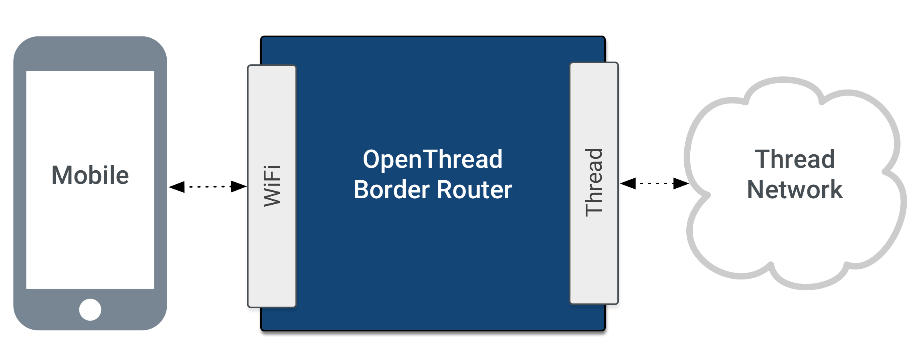
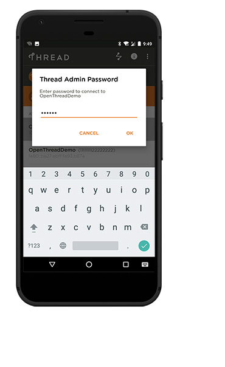

# OpenThread Border Router <br><small>An open source border router, designed to work with OpenThread</small>


## Introduction

A Thread Border Router serves as a gateway between the Internet and the Thread network. OpenThread's implementation of a Border Router is called OpenThread Border Router (OTBR).



OTBR includes a number of features, including:

* [Web GUI](https://openthread.io/guides/border-router/web-gui) for configuration and management
* Thread Border Agent to support [external commissioning](https://openthread.io/guides/border-router/external-commissioning)
* DHCPv6 Prefix Delegation to obtain IPv6 prefixes for a Thread network
* [NAT64](https://openthread.io/guides/border-router/access-point#configure-nat) for connecting to IPv4 networks
* [DNS64](https://openthread.io/guides/border-router/access-point#configure-dnsmasq) to allow Thread devices to initiate communications by name to an IPv4-only server
* Thread interface driver using [wpantund](https://openthread.io/guides/ncp/#wpantund)

For more technical details, [openthread.io](https://openthread.io/guides/border_router) is the best place for you.

In the following documentation sections, you'll build an OpenThread Border Router with nRF52840 MDK USB Dongle and Raspberry Pi 3B.

## Required hardware

* Raspberry Pi 3B
* nRF52840 MDK USB Dongle with the latest NCP firmware
* 4 GB (or larger) microSD card and microSD card reader
* microUSB power supply for Raspberry Pi 3B

## Getting started

Complete the following steps to set up the Border Router on Raspberry Pi 3B.

### Download and install Raspbian

Download the [RASPBIAN STRETCH LITE](https://www.raspberrypi.org/downloads/raspbian/) image to your host and follow the [installation guide](https://www.raspberrypi.org/documentation/installation/installing-images/README.md) to install the image on an microSD card.

### Set up the Border Router

!!! Warning
	Before you continue, make sure your Raspberry Pi 3B is connected to the internet using Ethernet. The **bootstrap** script disables the platform's Wi-Fi interface and the **setup** script requires internet connectivity to download and install **wpantund**.


OTBR communicates with the Dongle(serves as NCP) via `wpantund`. On Raspberry Pi 3B:

1. Clone the OTBR repository:

	``` sh
	git clone https://github.com/openthread/borderrouter
	```

2. Install dependencies:

	``` sh
	cd borderrouter
	./script/bootstrap
	```

3. Compile and install OTBR and `wpantund`:

	``` sh
	./script/setup
	```

4. Attach the Dongle to the Border Router platform via USB.

	

5. Configure the Dongle's serial port in `wpantund`. Add the serial port name to `/etc/wpantund.conf`. For example, for a serial port name of `ttyACM0`:

	``` sh
	Config:NCP:SocketPath "/dev/ttyACM0"
	```

6. Restart the Border Router. The OTBR service should start on boot.

### Verify services

On Raspberry Pi 3B, verify that all required services are enabled:

``` sh
sudo systemctl status
```

If the `setup` script above was successful, the RPI3B is in `running` state and the following services appear in the output:

* `wpantund.service`
* `avahi-daemon.service`
* `otbr-web.service`
* `otbr-agent.service`

If the RPI3B is in **degraded** state, some other service has failed to start. Check to see which:

``` sh
sudo systemctl --failed
```

If the failed service is **tayga** or **dnsmasq**, it is normal. These services are completely configured as part of the [Wi-Fi Access Point Setup](https://openthread.io/guides/border-router/access-point).

### Verify NCP

Verify that the NCP is in the correct state:

``` sh
sudo wpanctl status
```

`wpanctl` is a command line utility provided with `wpantund`. It is used to communicate with the wireless PAN interface (default is `wpan0`) that `wpantund` is bound to in the NCP design.

If the NCP is successfully running OpenThread and is not a member of a Thread network, the output should be similar to the below:

``` sh
wpan0 => [
        "NCP:State" => "offline"
        "Daemon:Enabled" => true
        "NCP:Version" => "OPENTHREAD/20170716-00889-g4ce55934; NRF52840; Sep 13 2018 20:55:40"
        "Daemon:Version" => "0.08.00d (/4eb20ac; Sep 13 2018 08:00:41)"
        "Config:NCP:DriverName" => "spinel"
        "NCP:HardwareAddress" => [74358AAD04866C78]
]
```

!!! tip
	For more features(such as external commissioning), you can follow the [Update NCP firmware](../getting-started/#update-ncp-firmware) section to running the latest NCP firmware.

If the `NCP:State` is `uninitialized`, troubleshoot with the following:

1. Verify the RPI3B has sufficient power (use the proper external AC adapter).
2. Disconnect and reconnect the Dongle to the RPI3B.
3. Verify that the NCP serial device is present. For example, if the device should be attached to `/dev/ttyACM0`:

	``` sh
	ls /dev/ttyACM*
	/dev/ttyACM0
	```

4. Reset the NCP with `sudo wpanctl reset`.
5. Check the NCP status again with `sudo wpanctl status`.


### Web GUI

Now, you can use the OpenThread Border Router (OTBR) Web GUI to configure and form, join, or check the status of a Thread network.

The Border Router enables Access Point mode and advertises the **BorderRouter-AP** network default. 

Connect to the **BorderRouter-AP** Wi-Fi network and access the Web GUI by visiting the OTBR's local IPv4 address(`10.42.0.1` default) in a mobile browser:


#### Join a Thread network

Use the **Join** menu option to scan for and join an existing Thread network.

#### Form a Thread network

Use the **Form** menu option to create a new Thread network.


After the network forms, confirm by checking the **Status** menu option or running `sudo wpanctl status` on the command line of the OTBR:


### External Thread Commissioning

OpenThread Border Router (OTBR) features a Thread Border Agent, which supports external Thread Commissioning. In external Thread Commissioning, a device outside of the Thread network (for example, a mobile phone) commissions new devices onto the network.


This section details how to use the Thread Commissioning App to commission an OpenThread device onto a network created and managed by the OTBR Web GUI.

#### Set up the Joiner device

You should prepare another Dongle or an nRF52840 board(such as [nRF52840-MDK](https://wiki.makerdiary.com/nrf52840-mdk/)). Flash the board with the OpenThread CLI firmware. Here is the pre-built CLI firmware for the Dongle:

<a href="https://github.com/makerdiary/nrf52840-mdk-usb-dongle/tree/master/firmware/openthread/cli"><button data-md-color-primary="red-bud">CLI firmware</button></a>

!!! note 
	For programming, just follow the "[Programming](../programming/)" section.


Once the Joiner device is ready, obtain its factory-assigned IEEE EUI-64. Use the `eui64` command in the OpenThread CLI:

``` sh
> eui64
4499f69d088dac4b
Done
```

#### Download the Thread Commissioning App

External commissioning is supported by the Thread Commissioning App, available for download on the Google Play Store for Android devices.

<a href="https://play.google.com/store/apps/details?id=org.threadgroup.commissioner&hl=en"><button data-md-color-primary="red-bud">Thread Commissioning App</button></a>

#### Connect to the Border Router

Start the Thread Commissioning App, then tap **FIND WI-FI NETWORK** and connect your phone running the Thread Commissioning App to the Wi-Fi access point.


Select the target Border Router from the available list. The name is the same as the Thread network created by the OTBR Web GUI. If the same Border Router shows up multiple times with different IPv4 and IPv6 addresses, select the one with the static IPv4 address used for the Wi-Fi access point setup (`10.42.0.1` here).

When prompted for a password, enter the passphrase (Commissioner Credential) set by the OTBR Web GUI.



#### Commission the Joiner

Once connected to the Border Router, the app provides the option to scan a Connect QR Code or enter a Join Passphrase manually.

Thread Connect QR Codes are created with the following text string format:

``` sh
v=1&&eui=4499f69d088dac4b&&cc=J01NU5
```
Where `eui` is the Joiner device's EUI64 value and `cc` is the Joiner Credential.

Use this text string with an online QR Code generator(such as [unitag.io](https://unitag.io)) to create a QR Code for scanning.


In the Thread Commissioning App, scan the Connect QR Code of the Joiner device:


While the app is waiting, enter the OpenThread CLI on the Joiner device and start the Joiner role with that same Joiner Credential:

``` sh
> ifconfig up
Done
> joiner start J01NU5
Done
```

Wait a minute for the DTLS handshake to complete between the Commissioner and Joiner:

``` sh
> Join success
```


#### Join the network

On the Joiner device, start the Thread protocol to automatically join the network.

``` sh
> thread start
Done
```

Check the state after a few moments to confirm. It may initially start as a Child, but within two minutes, it will upgrade to a Router.

``` sh
> state
router
Done
```

Obtain the addresses of the joiner by typing `ipaddr`:

``` sh
> ipaddr
fd11:1111:1122:0:0:ff:fe00:4400
fd11:22:0:0:8250:8753:2ff9:ac2f
fe80:0:0:0:c43d:cdd:9e66:6d4e
fd11:1111:1122:0:87a9:87be:ed3a:299e
Done
```

#### Check the Internet connectivity

Test the connectivity between the Joiner device in the Thread network and the Internet by pinging a public IPv4 address. To reach the IPv4 address from the Thread device, a Well-Known Prefix of `64:ff9b::/96` and an IPv4 address of the destination are used. 

To ping Google’s DNS `8.8.8.8` from the IPv6 address, append a hexadecimal form of the IPv6 to the Well-Known Prefix resulting in: `64:ff9b::808:808`.

``` sh
> ping 64:ff9b::808:808
> 16 bytes from 64:ff9b:0:0:0:0:808:808: icmp_seq=0 hlim=39 time=37ms

> ping 64:ff9b::808:808
> 16 bytes from 64:ff9b:0:0:0:0:808:808: icmp_seq=1 hlim=39 time=35ms

> ping 64:ff9b::808:808
> 16 bytes from 64:ff9b:0:0:0:0:808:808: icmp_seq=2 hlim=39 time=35ms

```

## Congratulations!

You've successfully created an OpenThread Border Router, while allowing the Joiner device in the Thread network communicating with the Internet.


## Reference

* [openthread.io/guides/border-router](https://openthread.io/guides/border-router/)
* [Nordic Thread Border Router](http://infocenter.nordicsemi.com/topic/com.nordic.infocenter.thread_zigbee.v1.0.0/thread_border_router.html)
* [Build a Thread network with nRF52840-MDK](https://wiki.makerdiary.com/nrf52840-mdk/openthread/)


## License
Content on this page is licensed under the [Creative Commons Attribution 3.0 License](https://creativecommons.org/licenses/by/3.0/).


## Create an Issue

Interested in contributing to this project? Want to report a bug? Feel free to click here:

<a href="https://github.com/makerdiary/nrf52840-mdk-usb-dongle/issues/new"><button data-md-color-primary="red-bud"><i class="fa fa-github"></i> Create an Issue</button></a>

