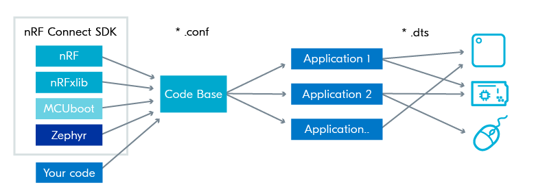

# Introducing nRF Connect SDK

<aside class="mdx-author" markdown>
![@makerdiary][@makerdiary avatar]

[makerdiary]

:octicons-calendar-24: Aug 7, 2023 ·
:octicons-clock-24: 5 min read

</aside>

[makerdiary]: https://makerdiary.com
[@makerdiary avatar]: https://avatars.githubusercontent.com/u/8767354

## Overview

nRF Connect SDK is a scalable and unified software development kit for building products based on Nordic Semiconductor's nRF52, nRF53, nRF70 and nRF91 Series wireless devices. It offers developers an extensible framework for building size-optimized software for memory-constrained devices as well as powerful and complex software for more advanced devices and applications.

It integrates the Zephyr Real-Time Operating System (RTOS) and a wide range of complete applications, samples, and protocol stacks such as Bluetooth Low Energy, Bluetooth mesh, Matter, Thread/Zigbee and LTE-M/NB-IoT/GPS, TCP/IP. It also includes middleware such as CoAP, MQTT, LwM2M, various libraries, hardware drivers, Trusted Firmware-M for security, and a secure bootloader (MCUBoot).

The following figure illustrates the architecture of the nRF Connect SDK, where Zephyr RTOS and third-party components (Ex: MCUBoot, Trusted Firmware-M) are shown in dark blue:

## About Zephyr RTOS

Zephyr RTOS is an open-source real-time operating system for connected and resource-constrained embedded devices. It includes a scheduler that ensures predictable/deterministic execution patterns and abstracts out the timing requirements. It also comes with a rich set of fundamental libraries and middleware that simplifies development and helps reduce a product’s time to market. Zephyr RTOS is highly configurable and enables scalable configurations from very small configurations for memory-constrained devices (minimum 8 kilobytes, for example, simple LED blinking application) to powerful, feature-rich, high-processing power devices (multiple MBs of memory) with large memory configurations.

[Zephyr RTOS](https://www.zephyrproject.org/){ .md-button .md-button--primary }

## How nRF Connect SDK code is organized

The nRF Connect SDK offers a single code base for all of Nordic’s devices and software components. It simplifies porting modules, libraries, and drivers from one application to another, thus reducing development time. By enabling developers to pick and choose the essential software components for their application, high memory efficiency is guaranteed. The nRF Connect SDK is publicly hosted on GitHub.

Internally, the nRF Connect SDK code is organized into four main repositories:

- nrf – Applications, samples, connectivity protocols (Nordic)
- nrfxlib – Common libraries and stacks (Nordic)
- Zephyr – RTOS & Board configurations (open source)
- MCUBoot – Secure Bootloader (open source)

In addition to the four main repositories, there are also other repositories like the TrustedFirmware-M repository and the Matter repository.

## Tools and configuration

The figure below visualizes the toolchain in the nRF Connect SDK, which is based on the Zephyr toolchain. You can see a set of different tools, each playing a role in the creation of an application, from configuring the system to building it.

Kconfig generates definitions that configure the whole system, for example which wireless protocol or which libraries to include in your application. Devicetree describes the hardware. CMake then uses the information from Kconfig and the devicetree to generate build files, which Ninja will use to build the program. The GCC compiler system is used to create the executables.

This high decoupling of the source code (`*.c`) and the configuration system through Kconfig (`*.conf`) and the hardware description system through devicetree (`*.dts`) makes it easy to use the same application source code on different hardware and with different configurations with minimal changes. This has a huge impact on the ease of portability and maintainability.

## Next steps

Now that we have an understanding of the content and structure of the nRF Connect SDK, let’s move to the developer guides which will step you through the basics of nRF Connect SDK development and show you how to implement typical use cases with Nordic Semiconductor libraries and drivers on nRF52840 MDK USB Dongle.

[nRF Connect SDK Developer Guides](../guides/ncs/index.md){ .md-button .md-button--primary }
