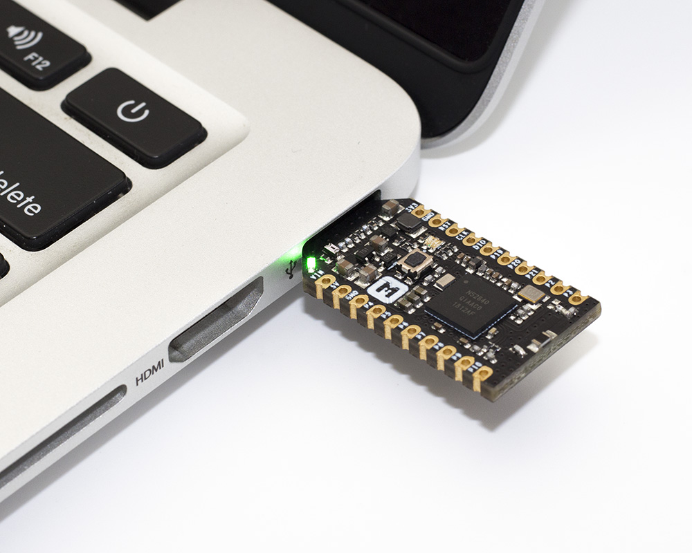

# Getting started with nRF52840 MDK USB Dongle

## Introduction

This guide details how to get started with the nRF52840 MDK USB Dongle development, and what to expect when you do so.

When you get a new dongle, it has been preprogrammed with the OpenThread NCP image. So you can easily set up a Thread NCP Joiner, which can be securely authenticated and commissioned onto a Thread network.

## What you'll need

* nRF52840 MDK USB Dongle
* PC running a Linux based operating system or MacOS
* wpantund

## Installing wpantund

[wpantund](https://github.com/openthread/wpantund) is a user-space network interface driver/daemon that provides a native IPv6 network interface to a low-power wireless Network Co-Processor (NCP). It was written and developed by Nest Labs to make supporting Thread connectivity on Unix-like operating systems more straightforward.

**wpantund** is designed to marshall all access to the NCP, ensuring that it always remains in a consistent and well-defined state.

Follow the [wpantund Installation Guide](https://github.com/openthread/wpantund/blob/master/INSTALL.md) to install wpantund on Ubuntu or macOS.

## Connecting the USB Dongle

Connect the nRF52840 MDK USB Dongle to your host as shown below: 



The USB Dongle will be recognized as an nRF52840 OpenThread Device like this:


## Configure wpantund

In the NCP design, use `wpantund` to communicate with and manage the Thread device.

In a terminal window, start `wpantund` on the serial port with the NCP, creating the interface `utun7` and enabling info logs:

``` sh
$ sudo /usr/local/sbin/wpantund -o Config:NCP:SocketPath /dev/cu.usbmodem14112  \
        -o Config:TUN:InterfaceName utun7 \
        -o Daemon:SyslogMask " -info"
```

!!! tip
	To configure wpantund without using command line parameters, modify the `/etc/wpantund.conf` file.

If the NCP is successfully running OpenThread, the output should be similar to the below:

``` sh
Sep 11 20:51:21  wpantund[39634] <Notice>: Starting wpantund 0.08.00d (Jun  9 2018 00:31:51) . . .
Sep 11 20:51:21  wpantund[39634] <Notice>: 	SOURCE_VERSION = 0.07.01-217-g86d29d6
Sep 11 20:51:21  wpantund[39634] <Notice>: 	BUILD_VERSION = 0.07.01-217-g86d29d6
Sep 11 20:51:21  wpantund[39634] <Notice>: Configuration file "/etc/wpantund.conf" read.
Sep 11 20:51:21  wpantund[39634] <Notice>: Ready. Using DBUS bus ":1.0"
Sep 11 20:51:21  wpantund[39634] <Notice>: Running as root without dropping privileges!
Sep 11 20:51:21  wpantund[39634] <Notice>: [-NCP-]: NCP was reset (STATUS_RESET_POWER_ON, 112)
Sep 11 20:51:21  wpantund[39634] <Error>: Unexpected reset during NCP initialization.
Sep 11 20:51:21  wpantund[39634] <Error>: Resetting and trying again... (retry 1)
Sep 11 20:51:21  wpantund[39634] <Notice>: [-NCP-]: NCP was reset (STATUS_RESET_POWER_ON, 112)
Sep 11 20:51:21  wpantund[39634] <Notice>: State change: "uninitialized" -> "offline"
Sep 11 20:51:21  wpantund[39634] <Notice>: NCP is running "OPENTHREAD/20170716-00745-g79e35c57; NRF52840; Jul 15 2018 09:52:08"
Sep 11 20:51:21  wpantund[39634] <Notice>: Driver is running "0.08.00d (0.07.01-217-g86d29d6; Jun  9 2018 00:31:51)"
Sep 11 20:51:21  wpantund[39634] <Notice>: Network is not joinable
Sep 11 20:51:21  wpantund[39634] <Notice>: Resetting interface(s). . .
Sep 11 20:51:21  wpantund[39634] <Notice>: Finished initializing NCP
```

Leave this terminal window open so that logs from wpantund can be viewed.

A user-defined interface is required to communicate with the NCP using `wpanctl`. Open a new terminal window and using `wpanctl`, connect to the interface you just set up:

``` sh
$ sudo /usr/local/bin/wpanctl -I utun7
wpanctl:utun7>
```

## Verify NCP

Verify that the NCP is in the correct state:

``` sh
wpanctl:utun7> status
utun7 => [
	"NCP:State" => "offline"
	"Daemon:Enabled" => true
	"NCP:Version" => "OPENTHREAD/20170716-00745-g79e35c57; NRF52840; Jul 15 2018 09:52:08"
	"Daemon:Version" => "0.08.00d (0.07.01-217-g86d29d6; Jun  9 2018 00:31:51)"
	"Config:NCP:DriverName" => "spinel"
	"NCP:HardwareAddress" => [38D6B665CE553B4F]
]
```

Now, you can scan for networks on the NCP Joiner. If you have formed a Thread network, the output should be similar to the below:


!!! tip
    You can follow this guide to [Build a Thread network with nRF52840-MDK](https://wiki.makerdiary.com/nrf52840-mdk/openthread/) for testing.


## Update NCP firmware

More features will be added to the NCP firmware gradually over time. The latest pre-built NCP firmware is a `.hex` file. You can download here:

<a href="https://github.com/makerdiary/nrf52840-mdk-usb-dongle/tree/master/firmware/openthread/ncp"><button data-md-color-primary="red-bud">NCP firmware</button></a>

While holding the dongle's RESET/USR button, connect it to your computer. When the Dongle has entered the bootloader mode, the RGB LED pulses RED. It is now ready for programming.

!!! note 
	For programming, just follow the "[Programming](programming.md)" section.

## How to build NCP firmware?

You can also build the latest NCP firmware by yourself. The following steps detail how to do that.

1. Clone and install OpenThread:

	``` sh
	$ git clone --recursive https://github.com/openthread/openthread.git
	$ cd openthread
	$ ./bootstrap
	```

2. Build the firmware with the following commands:

	``` sh
	$ make -f examples/Makefile-nrf52840 clean
	$ make -f examples/Makefile-nrf52840 USB=1 BOOTLOADER=1 BORDER_AGENT=1 BORDER_ROUTER=1 COMMISSIONER=1 JOINER=1 UDP_PROXY=1 CFLAGS+=-UCONFIG_GPIO_AS_PINRESET
	```

	!!! warning
		You MUST undefine the `CONFIG_GPIO_AS_PINRESET` flag, or the Dongle would not enter the bootloader mode next time by holding the dongle's RESET/USR button. 

		Please remember to add `CFLAGS+=-UCONFIG_GPIO_AS_PINRESET` to undefine the `CONFIG_GPIO_AS_PINRESET` flag!

3. Navigate to the directory with the OpenThread FTD NCP binary, and convert it to hex format:

	``` sh
	$ cd ~/openthread/output/nrf52840/bin
	$ arm-none-eabi-objcopy -O ihex ot-ncp-ftd ot-ncp-ftd.hex
	```

	The `ot-ncp-ftd.hex` file is the expected NCP firmware.

## More applications 

See the following topics for further introduction:

* [Build an OpenThread Border Router with Raspberry Pi 3B](OTBR.md)
* [Build a Thread Network Sniffer with Wireshark](thread-sniffer.md)


## Clone the repository

Clone the [makerdiary/nrf52840-mdk-usb-dongle](https://github.com/makerdiary/nrf52840-mdk-usb-dongle) repository or download it as a zip package and put its contents to your working directory.

``` sh
$ git clone https://github.com/makerdiary/nrf52840-mdk-usb-dongle.git
```

This repository provides documents and example applications that you can run on your board to ensure that everything is set up correctly.

You can also star or watch this repository to let GitHub send you notifications when something new is added.

<!-- Place this tag where you want the button to render. -->
<a class="github-button" href="https://github.com/makerdiary/nrf52840-mdk-usb-dongle" data-icon="octicon-star" data-size="large" data-show-count="true" aria-label="Star makerdiary/nrf52840-mdk-usb-dongle on GitHub">Star</a>

<!-- Place this tag in your head or just before your close body tag. -->
<script async defer src="https://buttons.github.io/buttons.js"></script>


## Reference

* [Build a Thread network with nRF52840-MDK](https://wiki.makerdiary.com/nrf52840-mdk/openthread/)

* [Thread Primer](https://openthread.io/guides/thread_primer/) — covers all the Thread concepts in this documentation

* [Build a Thread network with nRF52840 boards and OpenThread](https://codelabs.developers.google.com/codelabs/openthread-hardware/#0)

## License
Content on this page is licensed under the [Creative Commons Attribution 3.0 License](https://creativecommons.org/licenses/by/3.0/).

## Create an Issue

Interested in contributing to this project? Want to report a bug? Feel free to click here:

<a href="https://github.com/makerdiary/nrf52840-mdk-usb-dongle/issues/new"><button data-md-color-primary="red-bud"><i class="fa fa-github"></i> Create an Issue</button></a>

