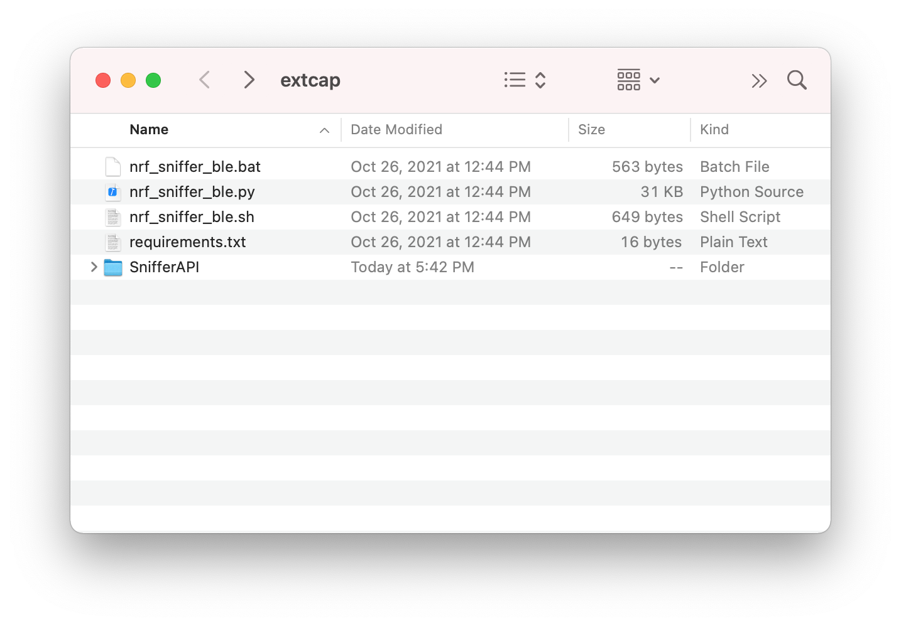

# Installing the nRF Sniffer

The nRF Sniffer for Bluetooth LE software consists of firmware that is programmed onto a nRF52840 MDK USB Dongle and a capture plugin for [Wireshark] that records and analyzes the detected data.

This section of the documentation explains how to install the nRF Sniffer for Bluetooth LE software.

## Programming the nRF Sniffer firmware

You must connect a nRF52840 MDK USB Dongle running the nRF Sniffer firmware to your computer to be able to use the nRF Sniffer for Bluetooth LE.

The nRF Sniffer firmware in `.uf2`-format is located in [`firmware/ble_sniffer/`](https://github.com/makerdiary/nrf52840-mdk-usb-dongle/tree/main/firmware/ble_sniffer).

Download the latest firmware and complete the following steps to flash the firmware:

1. Push and hold the button and plug your dongle into the USB port of your computer. Release the button after your dongle is connected. The RGB LED turns green.

2. It will mount as a Mass Storage Device called __UF2BOOT__.

3. Drag and drop `nrf_sniffer_for_bluetooth_le_<version>.uf2` onto the __UF2BOOT__ volume. The RGB LED blinks red fast during flashing.

4. Re-plug the dongle and the nRF Sniffer will start running.

!!! Tip "Button Changed after programmed"
    The button will be configured as RESET functionality after programmed with the sniffer firmware. The next time you want to enter UF2 Bootloader mode, just double-click the button after plugged the dongle. If you want to change the button to GPIO functionality, try the [button sample](../ncs/samples/button.md) in NCS guide.

## Installing Wireshark

To install Wireshark for your operating system, complete the following steps:

=== "Windows/macOS"

    1. Go to the [Wireshark download page].
    2. Click the release package for your operating system from the __Stable Release__ list. The download starts automatically.
    3. Install the package.

=== "Ubuntu Linux"
    1. Download the Wireshark standard package or the latest stable PPA for Ubuntu Linux distribution from the [Wireshark download page].
    2. Install the package on your computer.
    3. Answer `yes` when the installer asks you if non-superusers should be able to capture packets. This ensures that packet capture is available to all users in the _wireshark_ system group.
    4. Add the correct user to the _wireshark_ user group. For example, type `sudo usermod -a -G wireshark $USER`.
    5. Add the correct user to the _dialout_ user group. For example, type `sudo usermod -a -G dialout $USER`.
    6. Restart your computer to apply the new user group settings.

## Installing the nRF Sniffer capture tool

The nRF Sniffer for Bluetooth LE software is installed as an external capture plugin in Wireshark.

To install the nRF Sniffer capture tool, complete the following steps:

1. Install the Python requirements:

    1. Open a command window in the `tools/ble_sniffer/extcap/` folder.
    2. Install the Python dependencies listed in `requirements.txt` by doing one of the following:

        === "Windows with Python launcher"

            ``` bash linenums="1"
             py -3 -m pip install -r requirements.txt
            ```

        === "Windows without Python launcher"

            ``` bash linenums="1"
            python -m pip install -r requirements.txt
            ```
        
        === "Linux/macOS"

            ``` bash linenums="1"
            python3 -m pip install -r requirements.txt
            ```

    3. Close the command window.

2. Copy the nRF Sniffer capture tool into Wireshark's folder for personal external capture plugins:

    1. Open Wireshark.
    2. Go to __Help__ > __About Wireshark__ (on Windows or Linux) or __Wireshark__ > __About Wireshark__ (on macOS).

        
    
    3. Select the __Folders__ tab.
    4. Double-click the location for the __Personal Extcap path__ to open this folder.

        
    
    5. Copy the contents of the `tools/ble_sniffer/extcap/` folder into this folder.

        

3. Make sure that the nRF Sniffer files can be run correctly:

    1. Open a command window in Wireshark's folder for personal external capture plugins.
    2. Run the nRF Sniffer tool to list available interfaces.

        === "Windows"

            ``` bash linenums="1"
            nrf_sniffer_ble.bat --extcap-interfaces
            ```

        === "Linux/macOS"

            ``` bash linenums="1"
            ./nrf_sniffer_ble.sh --extcap-interfaces
            ```

        You should see a series of strings, similar to what is shown in the following:

        ``` { .bash .no-copy linenums="1" }
        extcap {version=4.1.1}{display=nRF Sniffer for Bluetooth LE}{help=https://www.nordicsemi.com/Software-and-Tools/Development-Tools/nRF-Sniffer-for-Bluetooth-LE}
        control {number=0}{type=selector}{display=Device}{tooltip=Device list}
        control {number=1}{type=selector}{display=Key}{tooltip=}
        control {number=2}{type=string}{display=Value}{tooltip=6 digit passkey or 16 or 32 bytes encryption key in hexadecimal starting with '0x', big endian format.If the entered key is shorter than 16 or 32 bytes, it will be zero-padded in front'}{validation=\b^(([0-9]{6})|(0x[0-9a-fA-F]{1,64})|([0-9A-Fa-f]{2}[:-]){5}([0-9A-Fa-f]{2}) (public|random))$\b}
        control {number=3}{type=string}{display=Adv Hop}{default=37,38,39}{tooltip=Advertising channel hop sequence. Change the order in which the sniffer switches advertising channels. Valid channels are 37, 38 and 39 separated by comma.}{validation=^\s*((37|38|39)\s*,\s*){0,2}(37|38|39){1}\s*$}{required=true}
        control {number=7}{type=button}{display=Clear}{tooltop=Clear or remove device from Device list}
        control {number=4}{type=button}{role=help}{display=Help}{tooltip=Access user guide (launches browser)}
        control {number=5}{type=button}{role=restore}{display=Defaults}{tooltip=Resets the user interface and clears the log file}
        control {number=6}{type=button}{role=logger}{display=Log}{tooltip=Log per interface}
        value {control=0}{value= }{display=All advertising devices}{default=true}
        value {control=0}{value=[00,00,00,00,00,00,0]}{display=Follow IRK}
        value {control=1}{value=0}{display=Legacy Passkey}{default=true}
        value {control=1}{value=1}{display=Legacy OOB data}
        value {control=1}{value=2}{display=Legacy LTK}
        value {control=1}{value=3}{display=SC LTK}
        value {control=1}{value=4}{display=SC Private Key}
        value {control=1}{value=5}{display=IRK}
        value {control=1}{value=6}{display=Add LE address}
        value {control=1}{value=7}{display=Follow LE address}
        ```

4. Enable the nRF Sniffer capture tool in Wireshark:

    1. Refresh the interfaces in Wireshark by selecting __Capture__ > __Refresh Interfaces__ or pressing ++f5++ . You should see that nRF Sniffer is displayed as one of the interfaces on the Wireshark capture screen.

        

    2. Select __View__ > __Interface Toolbars__ > __nRF Sniffer for Bluetooth LE__ to enable the nRF Sniffer interface.

## Adding a Wireshark profile for the nRF Sniffer

You can add a profile in Wireshark for displaying the data recorded by the nRF Sniffer for Bluetooth LE in a convenient way.

To add the nRF Sniffer profile in Wireshark, complete the following steps:

1. Go to __Help__ > __About Wireshark__ (on Windows or Linux) or __Wireshark__ > __About Wireshark__ (on macOS).
2. Select the __Folders__ tab.
3. Double-click the location for the __Personal configuration__ to open this folder.
4. Copy the profile folder `tools/ble_sniffer/Profile_nRF_Sniffer_Bluetooth_LE` into
the `profiles` subfolder of this folder.
5. In Wireshark, select __Edit__ > __Configuration Profiles...__.
6. Select __Profile_nRF_Sniffer_Bluetooth_LE__ and click __OK__.

    

[Wireshark]: https://www.wireshark.org/
[Wireshark download page]: https://www.wireshark.org/download.html