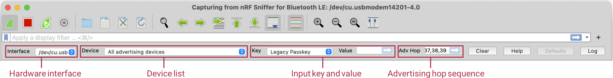
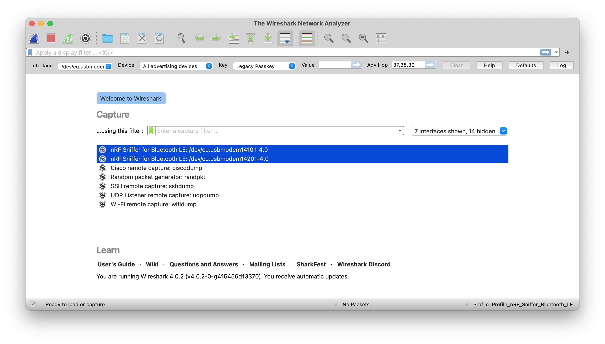
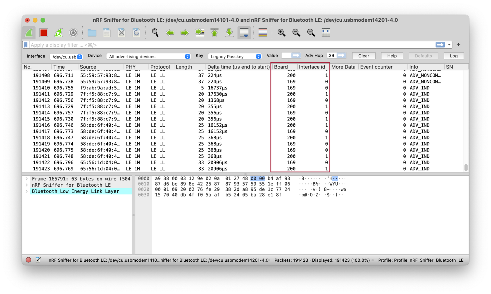
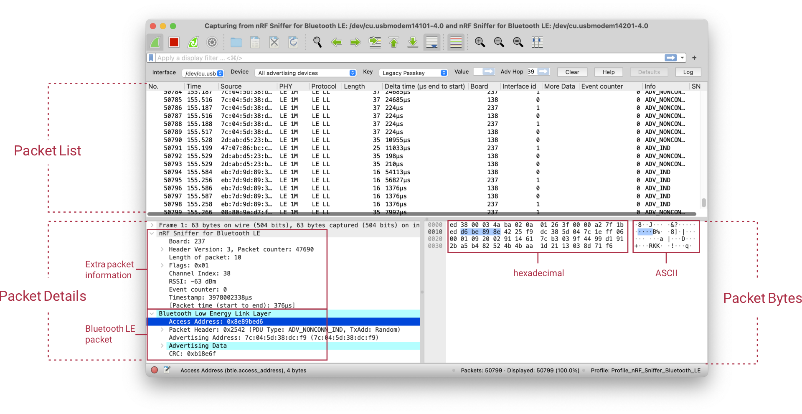

# nRF Sniffer usage

Once the nRF Sniffer for Bluetooth LE is running, it reports advertisements and lists nearby devices in the Device List. The software interface has several commands for controlling the operating mode of the nRF Sniffer.

## Basic operating

The nRF Sniffer has two modes of operation:

1. Listen on all advertising channels to pick up as many packets as possible from as many devices as possible. This is the default mode.

2. Follow one particular device and try to catch all packets sent to or from this particular device. This mode catches all:

    - Advertisements and Scan Responses sent from the device
    - Scan Requests and Connect Requests sent to the device
    - Packets in the connection sent between the two devices in the connection

__`Hardware interface`__

:   This list shows the available hardware interfaces. If you have more than one board with the nRF Sniffer firmware connected, you can choose which one to control with the toolbar. To use several hardware interfaces at the same time, see [Capturing from multiple hardware interfaces](#capturing-from-multiple-hardware-interfaces).

__`Device list`__

:   This list shows nearby devices that are advertising. When you start sniffing, All advertising devices is selected. Choose a device from the list to sniff that specific device. When you select a different device while in a connection, the current connection is no longer sniffed. 

    If the device that you want to sniff is not found by the sniffer, you can add it to the list manually. See __`Add LE Address`__ below.

    A device can also be selected from the list by providing the LE address manually. See __`Follow LE Address`__ below.

    If the device is privacy-enabled and the LE address is unknown, you can select Follow IRK and enter the IRK. See __`IRK`__ below.

__`Input key and value`__

:   Use this field to provide the nRF Sniffer with input information that cannot be captured from air-traffic alone. To do so, select the input key from the drop-down menu and enter the corresponding value in the input field. 

    The following input keys are available:

    _`Legacy Passkey`_

    :   If your device asks you to provide your passkey, type the 6-digit passkey in the passkey text field and press Enter. Then enter the passkey into the device.

    _`Legacy OOB data`_

    :   If your device uses a legacy pairing procedure with a 16-byte Out of Band (OOB) key, provide it in hexadecimal format (starting with `0x`, big endian). You must do this before the device enters encryption. If the entered key is shorter than 16 bytes, it is padded with zeros in front.

    _`Legacy LTK`_

    :   If your device has an existing bond using a legacy Long Term Key (LTK), provide it in hexadecimal format (starting with `0x`, big endian). You must do this before the device enters encryption. If the entered key is shorter than 16 bytes, it is padded with zeros in front.

    _`SC LTK`_

    :   If your device has an existing bond using an LE Secure Connections LTK, provide it in hexadecimal format (starting with `0x`, big endian). You must do this before the device enters encryption. If the entered key is shorter than 16 bytes, it is padded with zeros in front.

    _`SC Private Key`_

    :   If your device uses LE Secure Connections pairing and neither of the devices is in debug mode (using the Debug private key), provide the 32-byte Diffie-Hellman private key of your device in hexadecimal format (starting with `0x`, big endian). You must do this before the device starts the pairing procedure. If the entered key is shorter than 32 bytes, it is padded with zeros in front.

    _`IRK`_

    :   If your device is privacy-enabled, the IRK is needed to continue to follow the device when it changes its LE address. You should provide it in hexadecimal format (starting with `0x`, big endian). You must do this before the device enters encryption. If the entered key is shorter than 16 bytes, it is padded with zeros in front. When selecting a device that can be resolved with the IRK, the sniffer continues to follow any LE addresses that also resolves with the IRK. If the current LE address of the device is unknown, the device can be followed by selecting Follow IRK in the device list.

    _`Add LE Address`_

    :   If the device that you want to sniff is not currently advertising and therefore was not discovered, use this field to add its LE address to the device list. Input the full 6-byte LE address, separating each byte with a colon, and append the address type ("public" or "random"). For example: `57:25:b0:81:eb:e5 random`

        !!! Note
            If you add a device while capturing is stopped, the device does not show up in the device list until you start capturing.

    _`Follow LE Address`_

    :   If the device list is long, use this field to select the LE address in the device list. Input the full 6-byte LE address, separating each byte with a colon, and append the address type ("public" or "random"). For example: `57:25:b0:81:eb:e5 random`

        !!! Note
            If you follow a device while capturing is stopped, the device is not selected until you start capturing.

__`Advertising hop sequence`__

:   You can change the order in which the nRF Sniffer switches advertising channels when following a device. Define the order with comma-separated channel numbers, for example, `37,38,39`. Press ++enter++ when done.

    With the default configuration, the nRF Sniffer waits for a packet on channel 37. After it receives a packet on channel 37, it transitions to sniffing on channel 38. When it receives a packet on channel 38, it transitions to sniffing on channel 39. When it receives a packet on channel 39, it starts sniffing on channel 37, and repeats the operation.

__`Clear button`__

:   Click this button to remove all entries in the device list and start scanning for new devices. This button is active only when capturing is ongoing.

__`Defaults button`__

:   Click this button to remove all entries in the device list and set all configuration options to their default values. This button is active only when no capturing is ongoing.

__`Help button`__

:   Click this button to open the documentation.

__`Log button`__

:   Click this button to display the debug log and information about the nRF Sniffer version. Check this log if you encounter any issues, and include the information when reporting issues.

## Capturing from multiple hardware interfaces

You can capture packets from several hardware interfaces/devices simultaneously.

To capture from multiple hardware interfaces simultaneously, select the hardware interfaces in the capture screen and click __Start capturing packets__.

The captured data contains the interface identifier used by Wireshark to identify the capture interface (`frame.interface_id`) and the hardware identifier for the board running the nRF Sniffer firmware (`nordic_ble.board_id`).

!!! Tip
    If the _Board_ and _Interface id_ columns are not displayed, right-click the table header and select __Column Preferences__ to add them.

## Inspecting captured data

All Bluetooth® Low Energy packets detected by the Sniffer for Bluetooth LE are passed to Wireshark, where they are wrapped in a header containing useful meta-information not present in the Bluetooth Low Energy packet itself. Wireshark dissects the packets and separates the actual packet from the meta-information.

When you browse captured packets, select a packet in the __packet list__ to show the breakdown of that packet in the __packet Details pane__. The bytes of the packet are shown in the __packet bytes pane__. Click a value in the details to highlight it among the bytes, or click on the bytes to highlight it in the details.

To view the display filter for any field, click a value in the packet details pane. The display filter is shown in the bottom left corner.

Use display filters to display a chosen packet subset. Most filters are based on the values of the packets, such as length or access address. The filter expressions use Boolean operators (`&&` `||` `==` `!=` `!`). To construct a filter, click __Expression__ in the filtering bar. See the following table for some examples.

| Display filter             | Description |
|----------------------------|-------------|
| `btle.length != 0`         | Filter that displays only packets where the length field of the Bluetooth Low Energy packet is not zero, meaning it hides empty data packets. |
| `btle.advertising_address` | Filter that displays only packets that have an advertising address (advertising packets). |
| `btle`                     | Protocol filter that displays all Bluetooth Low Energy packets. |
| `btatt, btsmp, btl2cap`    | Protocol filters for ATT, SMP, and L2CAP packets, respectively. |
| `nordic_ble.channel < 37`  | Filter that displays only packets received on the data channels. |

The following tips can help when inspecting your data:

- Turn any field in the __packet details pane__ into a column. To do so:

    1. Right-click the value in the packet details.
    2. Click __Apply as Column__.

    

- Apply a value as a filter to, for example, see only operations affecting a particular handle. To filter packets that have a specific value for some field:

    1. Right-click the value in the packet details.
    2. Click __Apply as Filter__.
    3. Click __Selected__.

- Save a set of captured packets to be able to look at them later. To do so:

    1. Click the __Stop__ button to stop capturing packets.
    2. Click __File__ > __Save__ As to save all packets, or click __File__ > __Export Specified Packets__ to save a selection of packets.

-  Clear the packet list and restart a capture by clicking the __Restart__ button
