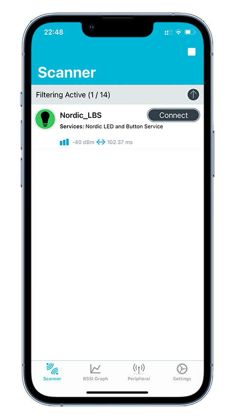
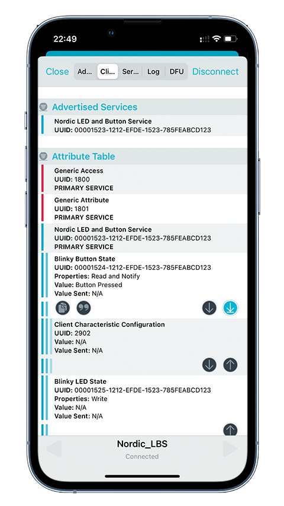

# Bluetooth Low Energy: Peripheral LBS

## Overview

The BLE Peripheral LBS sample demonstrates how to use the [LED Button Service (LBS)].

The GATT LED Button Service (LBS) is a custom service that receives information about the state of an LED and sends notifications when a button changes its state.

When connected, the sample sends the state of the button to the connected device, such as a phone or tablet. The mobile application on the device can display the received button state and control the state of Blue LED.

## Requirements

Before you start, check that you have the required hardware and software:

- 1x [nRF52840 MDK USB Dongle](https://makerdiary.com/products/nrf52840-mdk-usb-dongle)(or [w/Case](https://makerdiary.com/products/nrf52840-mdk-usb-dongle-w-case) option)
- A smartphone or a tablet with [nRF Connect for Mobile] installed
- A computer running macOS, Linux, or Windows 7 or newer

## Building the sample

Before you start building, remember to [set up the environment](../../setup.md) first.

Use the following steps to build the [BLE Peripheral LBS] sample on the command line.

1. Open a terminal window.

2. Go to `my-workspace/ncs-playground` directory created in the [Setting up the environment](../../setup.md#get-the-code) section.

    ``` bash linenums="1"
    cd my-workspace/ncs-playground
    ```

3. Build the sample using the `west` command, specifying the board (following the `-b` option) as `dongle_nrf52840`:

    ``` bash linenums="1"
    west build -p always -b dongle_nrf52840 samples/ble/peripheral_lbs
    ```

    !!! Tip
        The `-p always` option forces a pristine build, and is recommended for new users. Users may also use the `-p auto` option, which will use heuristics to determine if a pristine build is required, such as when building another sample.

4. After running the `west build` command, the build files can be found in `build/zephyr`.

## Flashing the firmware

The sample is designed to work with the UF2 Bootloader, so that you can easily flash the sample [using the UF2 Bootloader](../../../../programming/uf2boot.md). The firmware can be found in `build/zephyr` with the name `zephyr.uf2`.

To flash the firmware, complete the following steps:

1. Push and hold the button and plug your dongle into the USB port of your computer. Release the button after your dongle is connected. The RGB LED turns green.

2. It will mount as a Mass Storage Device called __UF2BOOT__.

3. Drag and drop `zephyr.uf2` onto the __UF2BOOT__ volume. The RGB LED blinks red fast during flashing.

4. Re-plug the dongle and the sample will start running.

## Testing

After flashing the firmware to your dongle, complete the following steps to test it:

1. Plug the dongle into the USB port of your computer.
2. Start the [nRF Connect for Mobile] app, scan the device and observe that the device is advertising with the Device Name __`Nordic_LBS`__.

    { width='250' }

3. Connect to the device from the application. The LBS Service with UUID `00001523-1212-EFDE-1523-785FEABCD123` is shown. This service has two characteristics:

    - __Blinky Button State__ with UUID `00001524-1212-EFDE-1523-785FEABCD123`
    - __Blinky LED State__ with UUID `00001525-1212-EFDE-1523-785FEABCD123`
    
    { width='250' }

4. In the __Blinky Button State__, click :material-arrow-collapse-down: to enable notifications, press the button on the dongle and observe that notifications with the following values are displayed:

    - `Button Released` when the button is released.
    - `Button Pressed` when the button is pressed.

    { width='250' }

5. In the __Blinky LED State__, click :material-arrow-up:, then select `Bool` and switch to `True` or `False` to control the Blue LED on the dongle. Then click __Write__ to send the value and observe the state of the Blue LED.

    { width='250' }


[LED Button Service (LBS)]: https://developer.nordicsemi.com/nRF_Connect_SDK/doc/latest/nrf/libraries/bluetooth_services/services/lbs.html#lbs-readme
[nRF Connect for Mobile]: https://www.nordicsemi.com/Products/Development-tools/nRF-Connect-for-mobile
[BLE Peripheral LBS]: https://github.com/makerdiary/ncs-playground/tree/main/samples/ble/peripheral_lbs