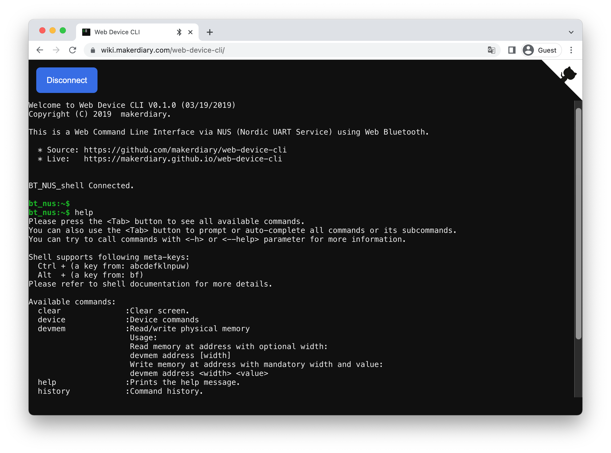

# Bluetooth Low Energy: NUS shell transport

## Overview

The Nordic UART Service (NUS) shell transport sample demonstrates how to use the [Nordic UART Service (NUS) shell transport] to receive shell commands from a remote device over Bluetooth®.

When the connection is established, you can connect to the sample through the [Nordic UART Service (NUS)] by using [Web Device CLI]. You can then send shell commands that are executed on the device running the sample.

## Requirements

Before you start, check that you have the required hardware and software:

- 1x [nRF52840 MDK USB Dongle](https://makerdiary.com/products/nrf52840-mdk-usb-dongle)(or [w/Case](https://makerdiary.com/products/nrf52840-mdk-usb-dongle-w-case) option)
- Chrome 56+ browser with [Web Bluetooth supported]
- A computer running macOS, Linux, or Windows 7 or newer

## Building the sample

Before you start building, remember to [set up the environment](../../setup.md) first.

Use the following steps to build the [NUS shell transport] sample on the command line.

1. Open a terminal window.

2. Go to `my-workspace/ncs-playground` directory created in the [Setting up the environment](../../setup.md#get-the-code) section.

    ``` bash linenums="1"
    cd my-workspace/ncs-playground
    ```

3. Build the sample using the `west` command, specifying the board (following the `-b` option) as `dongle_nrf52840`:

    ``` bash linenums="1"
    west build -p always -b dongle_nrf52840 samples/ble/shell_bt_nus
    ```

    !!! Tip
        The `-p always` option forces a pristine build, and is recommended for new users. Users may also use the `-p auto` option, which will use heuristics to determine if a pristine build is required, such as when building another sample.

4. After running the `west build` command, the build files can be found in `build/zephyr`.

## Flashing the firmware

The sample is designed to work with the UF2 Bootloader, so that you can easily flash the sample [using the UF2 Bootloader](../../../../programming/uf2boot.md). The firmware can be found in `build/zephyr` with the name `zephyr.uf2`.

To flash the firmware, complete the following steps:

1. Push and hold the button and plug your dongle into the USB port of your computer. Release the button after your dongle is connected. The RGB LED turns green.

2. It will mount as a Mass Storage Device called __UF2BOOT__.

3. Drag and drop `zephyr.uf2` onto the __UF2BOOT__ volume. The RGB LED blinks red fast during flashing.

4. Re-plug the dongle and the sample will start running.

## Testing

After flashing the firmware to your dongle, complete the following steps to test it:

1. Plug the dongle into the USB port of your computer.
2. Open the [Web Device CLI] page in the Chrome brower:

    [:material-console: Web Device CLI](https://wiki.makerdiary.com/web-device-cli/){ .md-button }

3. Click <kbd>**Connect**</kbd> to scan devices.
4. Pair  __`BT_NUS_shell`__ discovered in the list.
5. Run `help` to print the help message.



[Nordic UART Service (NUS) shell transport]: https://developer.nordicsemi.com/nRF_Connect_SDK/doc/latest/nrf/libraries/shell/shell_bt_nus.html#shell-bt-nus-readme
[Nordic UART Service (NUS)]: https://developer.nordicsemi.com/nRF_Connect_SDK/doc/latest/nrf/libraries/bluetooth_services/services/nus.html#nus-service-readme
[Web Device CLI]: https://wiki.makerdiary.com/web-device-cli/
[Web Bluetooth supported]: https://github.com/WebBluetoothCG/web-bluetooth/blob/main/implementation-status.md
[NUS shell transport]: https://github.com/makerdiary/ncs-playground/tree/main/samples/ble/shell_bt_nus