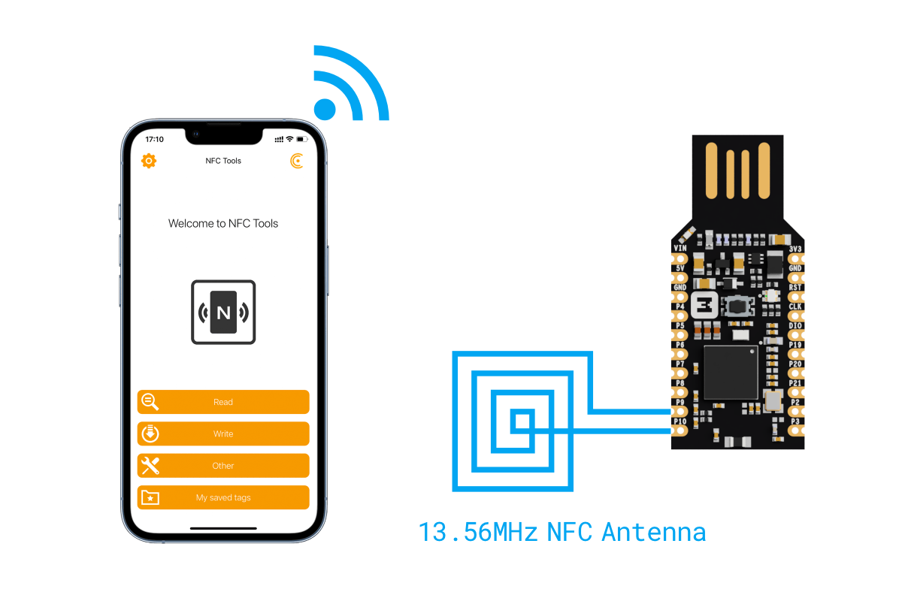

# NFC Writable NDEF message

## Overview

The Writable NDEF message sample shows how to use the NFC tag to expose an NDEF message that can be overwritten with any other NDEF message by an NFC device. It uses the [NFC Data Exchange Format (NDEF)].

When the sample starts, it initializes the NFC tag and loads the NDEF message from the file in flash memory. If the NDEF message file does not exist, a default message is generated. It is a URI message with a URI record containing the URL “https://makerdiary.com”. The sample then sets up the NFC library for the Type 4 Tag platform, which uses the NDEF message and senses the external NFC field.

The library works in Read-Write emulation mode. In this mode, procedures for reading and updating an NDEF message are handled internally by the NFC library. Any changes to the NDEF message update the NDEF message file stored in flash memory.

!!! Warning "Requirement of UF2 Bootloader"
    This sample requires your existing bootloader is at least __0.7.1__, as older versions of UF2 Bootloader use `NFC1` and `NFC2` pins as GPIO functionality. [Update the UF2 Bootloader](../../../../programming/uf2boot.md#updating-the-uf2-bootloader) if you are running the older bootloader.

## Requirements

Before you start, check that you have the required hardware and software:

- 1x [nRF52840 MDK USB Dongle](https://makerdiary.com/products/nrf52840-mdk-usb-dongle)
- A 13.56MHz NFC Antenna
- A smartphone or a tablet with NFC support
- A computer running macOS, Linux, or Windows 7 or newer

## Installing NFC Tools App

NFC Tools App can read and write your NFC tags with a simple and lightweight user interface.

[{ width='128' display='inline' }](hhttps://apps.apple.com/us/app/nfc-tools/id1252962749)
[{ width='148' display='inline' }](https://play.google.com/store/apps/details?id=com.wakdev.wdnfc)

## Wiring the NFC antenna



## Building the sample

Before you start building, remember to [set up the environment](../../setup.md) first.

Use the following steps to build the [Writable NDEF message] sample on the command line.

1. Open a terminal window.

2. Go to `my-workspace/ncs-playground` directory created in the [Setting up the environment](../../setup.md#get-the-code) section.

    ``` bash linenums="1"
    cd my-workspace/ncs-playground
    ```

3. Build the sample using the `west` command, specifying the board (following the `-b` option) as `dongle_nrf52840`:

    ``` bash linenums="1"
    west build -p always -b dongle_nrf52840 samples/nfc/writable_ndef_msg
    ```

    !!! Tip
        The `-p always` option forces a pristine build, and is recommended for new users. Users may also use the `-p auto` option, which will use heuristics to determine if a pristine build is required, such as when building another sample.

4. After running the `west build` command, the build files can be found in `build/zephyr`.

## Flashing the firmware

The sample is designed to work with the UF2 Bootloader, so that you can easily flash the sample [using the UF2 Bootloader](../../../../programming/uf2boot.md). The firmware can be found in `build/zephyr` with the name `zephyr.uf2`.

To flash the firmware, complete the following steps:

1. Push and hold the button and plug your dongle into the USB port of your computer. Release the button after your dongle is connected. The RGB LED turns green.

2. It will mount as a Mass Storage Device called __UF2BOOT__.

3. Drag and drop `zephyr.uf2` onto the __UF2BOOT__ volume. The RGB LED blinks red fast during flashing.

4. Re-plug the dongle and the sample will start running.

## Testing

After flashing the firmware to your board, complete the following steps to test it:

1. Plug the dongle into the USB port of your computer.
2. Touch the NFC antenna with the smartphone or tablet and observe that Red LED is lit.
3. Observe that the smartphone or tablet tries to open the URL "https://makerdiary.com" in a web browser.
4. Use [NFC Tools](#installing-nfc-tools-app) to overwrite the existing NDEF message with your own message.
4. Re-plug your dongle and touch the antenna again. Observe that the new message is displayed.

[NFC Data Exchange Format (NDEF)]: https://developer.nordicsemi.com/nRF_Connect_SDK/doc/latest/nrf/libraries/nfc/ndef/index.html#lib-nfc-ndef
[Writable NDEF message]: https://github.com/makerdiary/ncs-playground/tree/main/samples/nfc/writable_ndef_msg
