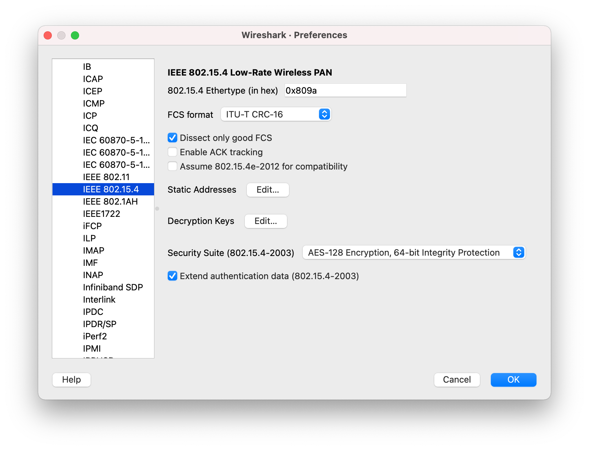
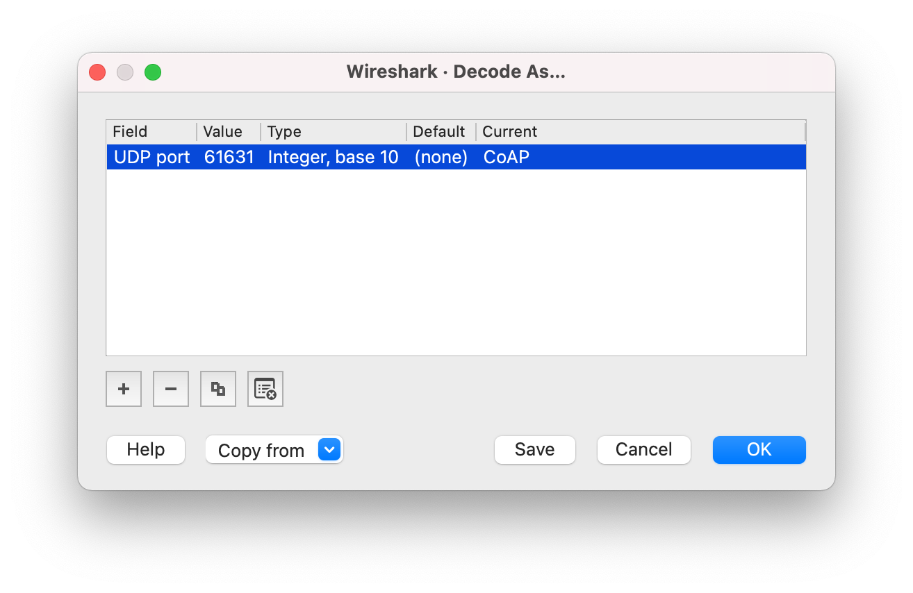
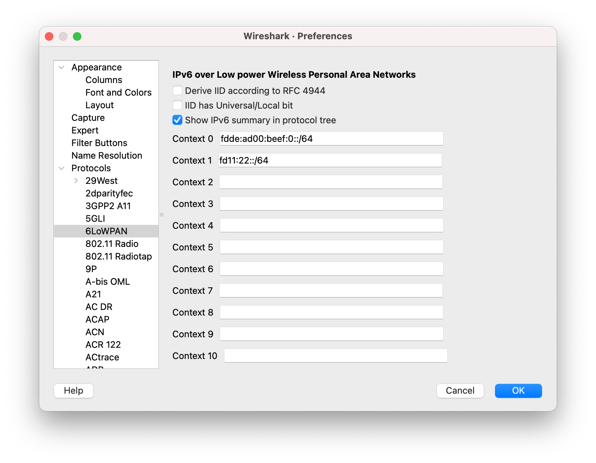
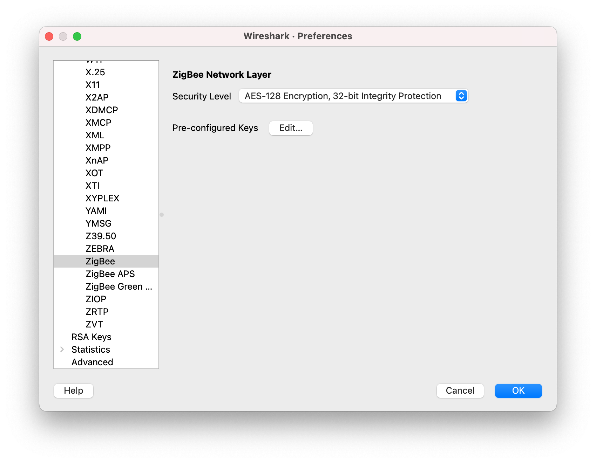
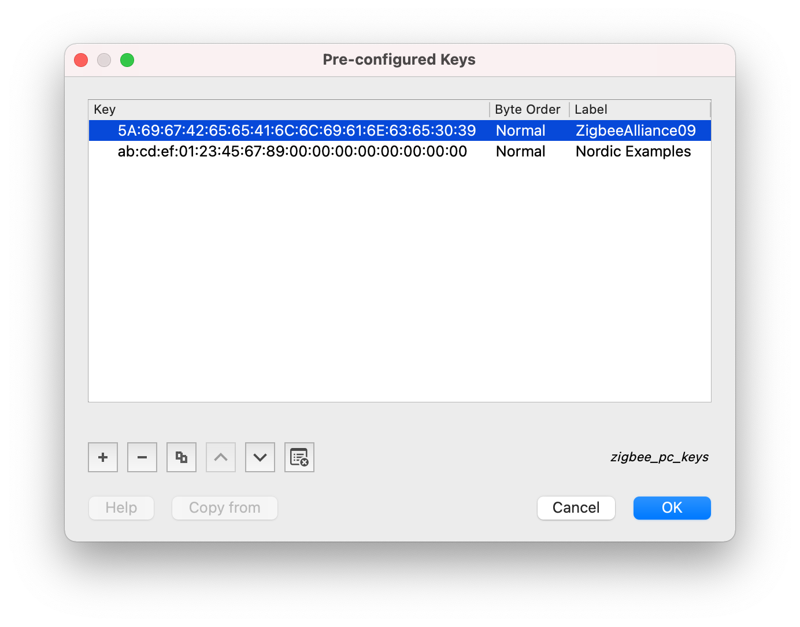

# Configuring Wireshark for the nRF Sniffer

The nRF Sniffer for 802.15.4 must be configured for capturing and analyzing packets exchanged on Thread and Zigbee networks.

## Configuring Wireshark for Thread

Capturing packets on a Thread network requires configuring at least the IEEE 802.15.4 decryption keys. Additionally, you can also configure the CoAP port and the 6loWPAN settings.

### Configuring decryption keys for Thread

You must configure IEEE 802.15.4 decryption keys to decode packets exchanged on the network and display the data in a readable format.

You need to know the Thread decryption key before you start configuring it in Wireshark. For example, if one of the devices in the Thread network has the OpenThread CLI enabled, you can check the decryption key by calling the `masterkey` CLI command.

To configure the decryption keys:

1. In Wireshark, go to __Edit__ > __Preferences...__ (on Windows or Linux) or __Wireshark__ > __Preferences...__ (on macOS).
2. In the __Preferences__ section list, go to __Protocols__ > __IEEE 802.15.4__.

    

3. Click the __Edit...__ button next to __Decryption Keys__.
4. In the __Keys__ window:

    1. Click __+__ and add the __Decryption key__ value with __Decryption key index__ set to `0` and __Key hash__ set to `Thread hash`.

        

    2. Click __OK__ to close the window.

5. Click __OK__ to save the decryption keys for Thread.

### Configuring CoAP port for Thread

The Thread network uses the CoAP protocol on port _61631_ for network management. You must configure this port in Wireshark if you want to correctly decode network management packets sent over this port.

#### Configuring CoAP port using Decode As

You can apply the CoAP protocol settings once on a per-capture basis using the __Decode As__ option.

To configure the CoAP port using this option:

1. In Wireshark, go to __Analyze__ > __Decode As...__.
2. In the __Decode As...__ settings window, click the __+__ button to add a new entry with the __Field__ set to __UDP port__, __Value__ set to _61631_, and __Current__ set to __CoAP__.

    

3. Click __OK__ to save the __Decode As...__ settings.

#### Configuring CoAP port using Preferences

You can apply the CoAP protocol settings globally by defining the CoAP port number in Wireshark Preferences.

To configure the CoAP port using this option:

1. In Wireshark, go to __Edit__ > __Preferences...__ (on Windows or Linux) or __Wireshark__ > __Preferences...__ (on macOS).
2. In the __Preferences__ section list, go to __Protocols__ > __CoAP__.

    

3. Set the __CoAP UDP port__ to `61631`.
4. Click __OK__ to save the CoAP port settings.

### Configuring 6loWPAN context

6loWPAN defines contexts that are used to shorten IPv6 addresses sent over-the-air. Configuring the 6loWPAN context ensures that the correct IPv6 address is displayed during packet analysis.

You can configure different 6loWPAN contexts depending on the Thread Network Data.

To configure the 6loWPAN contexts used by Thread examples:

1. In Wireshark, go to __Edit__ > __Preferences...__ (on Windows or Linux) or __Wireshark__ > __Preferences...__ (on macOS).
2. In the __Preferences__ section list, go to __Protocols__ > __6loWPAN__.
3. Set the following contexts to the provided values:
    
    1. In the __Context 0__ field, add `fdde:ad00:beef:0::/64`.
    2. In the __Context 1__ field, add `fd11:22::/64`.

    

4. Click __OK__ to save the 6loWPAN contexts for Thread.

### Disabling unwanted protocols

If Wireshark uses incorrect dissectors to decode a Thread message, you can optionally disable unwanted protocols.

To disable unwanted protocols when capturing data from a Thread network:

1. In Wireshark, go to __Analyze__ > __Enabled Protocols...__.
2. In the __Enabled Protocols__ window, disable unwanted protocols by unchecking the field next to their name.

    For example, you might want to disable __LwMesh__, __ZigBee__, and __ZigBee Green Power__.

    

3. Click __OK__ to save the settings.

## Configuring Wireshark for Zigbee

Additional Wireshark configuration is required to start capturing data from Zigbee samples in the [nRF Connect SDK] or from Zigbee examples in the [nRF5 SDK for Thread and Zigbee].

To capture data from Zigbee examples and samples:

1. In Wireshark, go to __Edit__ > __Preferences...__ (on Windows or Linux) or __Wireshark__ > __Preferences...__ (on macOS).
2. In the __Preferences__ section list, go to __Protocols__ > __ZigBee__.

    

3. Click the __Edit...__ button to add the preconfigured keys.
4. In the __Pre-configured Keys__ window:

    1. Click __+__ and add the key `5A:69:67:42:65:65:41:6C:6C:69:61:6E:63:65:30:39` with __Byte Order__ set to __Normal__ and __Label__ set to `ZigbeeAlliance09`.
    2. Click __+__ and add the key `ab:cd:ef:01:23:45:67:89:00:00:00:00:00:00:00:00` with __Byte Order__ set to __Normal__ and __Label__ set to `Nordic Examples`.

        

    3. Click __OK__ to close the window.

5. Click __OK__ to save the preferences for Zigbee.

[nRF Connect SDK]: https://infocenter.nordicsemi.com/topic/struct_sdk/struct/sdk_ncs_latest.html
[nRF5 SDK for Thread and Zigbee]: https://infocenter.nordicsemi.com/topic/struct_sdk/struct/sdk_thread_zigbee_latest.html