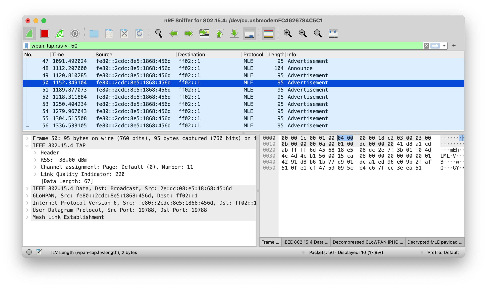
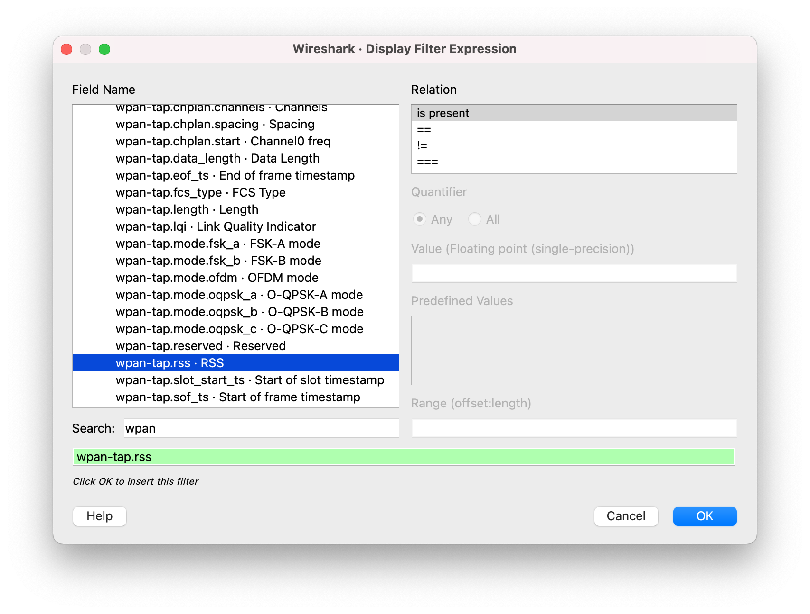

# Inspecting captured data

The nRF Sniffer passes all 802.15.4 packets to Wireshark, where they are wrapped in a header containing useful meta-information not present in the packet itself. Wireshark dissects the packets and separates the actual packet from the meta-information.

When you browse captured packets, select a packet in the __packet list__ to show the breakdown of that packet in the __packet details pane__. The hexadecimal view of the packet is shown in the __packet bytes pane__. Click a value in the details to highlight it among the bytes, or click on the bytes to highlight it in the details.

## Using Display Filter Expression

Use display filters to display a chosen packet subset. To open the filter menu and construct a filter:

1. Right-click the filtering bar.
2. Click __Display Filter Expression...__.

    

Most filters are based on the values of the packets, such as length or access address. The filter expressions use Boolean operators (`&&` `||` `==` `!=` `!`).

See the following table for some filter examples.

| Display filter | Description |
|----------------|-------------|
| `wpan`         | Filter that displays all IEEE 802.15.4 traffic. |
| `wpan.dst_pan` | Filter that displays IEEE 802.15.4 packets that have a specific destination PAN. |
| `wpan.dst16`   | Filter that displays short destination addresses of IEEE 802.15.4 frames. |
| `wpan.dst64`   | Filter that displays long destination addresses of IEEE 802.15.4 frames. |
| `wpan.src16`   | Filter that displays short source addresses of IEEE 802.15.4 frames. |
| `wpan.src64`   | Filter that displays long source addresses of IEEE 802.15.4 frames. |
| `ipv6`, `coap`, `dtls`, `udp` | Examples of filters for packets that can be encountered on Thread and IP networks. |
| `mle`          | Protocol filter that displays all Mesh Link Establishment traffic. Used for example by Thread. |

## Tips and Tricks

The following tips can help when inspecting your data:

- Turn any field in the __packet details pane__ into a column. To do so:

    1. Right-click the value in the packet details.
    2. Click __Apply as Column__.

    

- Apply a value as a filter to, for example, see only operations affecting a particular handle. To filter packets that have a specific value for some field:

    1. Right-click the value in the packet details.
    2. Click __Apply as Filter__.
    3. Click __Selected__.

- Save a set of captured packets to be able to look at them later. To do so:

    1. Click the __Stop__ button to stop capturing packets.
    2. Click __File__ > __Save As__ to save all packets, or click __File__ > __Export Specified Packets__ to save a selection of packets.

- Clear the packet list and restart a capture by clicking the __Restart__ button.

See the documentation on the [Wireshark] website for more information.

[Wireshark]: https://www.wireshark.org/