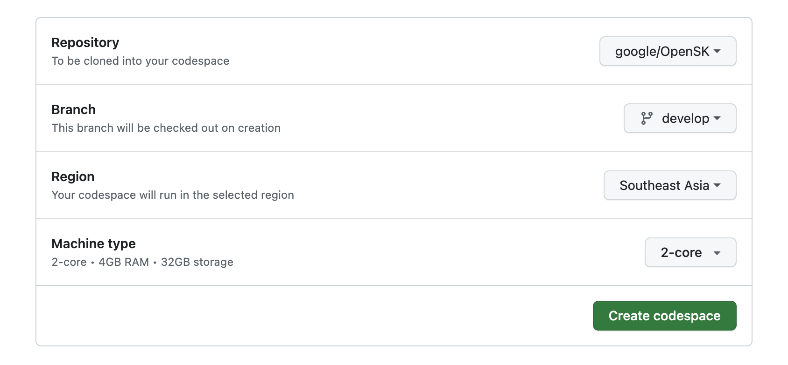
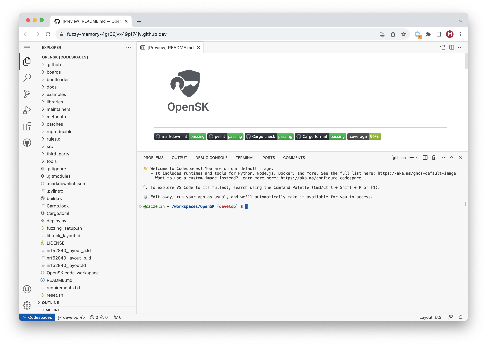

# Building your own OpenSK Firmware

## Introduction

This guide demonstrates how to build your own OpenSK firmware using GitHub Codespaces.

For instructions to build OpenSK on your local machine, please refer to OpenSK's [installation guide](https://github.com/google/OpenSK/blob/develop/docs/install.md).

## Requirements

Before you start, check that you have the required hardware and software:

* 1x [nRF52840 MDK USB Dongle](https://makerdiary.com/products/nrf52840-mdk-usb-dongle)(or [w/Case](https://makerdiary.com/products/nrf52840-mdk-usb-dongle-w-case) option)
* A GitHub account to use [Codespaces](https://github.com/codespaces)
* Latest version of Google Chrome, Mozilla Firefox, Microsoft Edge or Apple Safari

## Building OpenSK

1. Go to [GitHub Codespaces](https://github.com/codespaces) and click [New codespace](https://github.com/codespaces/new) to start.
2. On the __Create a new codespace__ page, select __google/OpenSK__ repository and the __develop__ branch, then click __Create codespace__.
    
3. After setting up your codespace, you will see the workspace for OpenSK.
    
4. In the __TERMINAL__ tab, run the following command to install Rust toolchain:

    ``` bash linenums="1"
    curl --proto '=https' --tlsv1.2 -sSf https://sh.rustup.rs | sh
    ```

5. Install Python dependencies:

    ``` bash linenums="1"
    python -m pip install --upgrade pip setuptools wheel
    ```

    ``` bash linenums="2"
    python -m pip install --pre -U git+https://github.com/makerdiary/uf2utils.git@main
    ```

6. Install `uuid-runtime` if you are missing the `uuidgen` command:

    ``` bash linenums="1"
    sudo apt-get update
    ```

    ``` bash linenums="2"
    sudo apt-get install uuid-runtime
    ```

7. Run the setup script:

    ``` bash linenums="1"
    ./setup.sh
    ```

8. Run the following command to build the firmware for nRF52840 MDK USB Dongle:

    ``` bash linenums="1"
    ./deploy.py --board=nrf52840_mdk_dfu --opensk --programmer=none
    ```
    
    After running this command, the firmware can be found in `target` folder with the name `nrf52840_mdk_dfu_merged.hex`.

9. Generate the OpenSK firmware in UF2:

    ``` bash linenums="1"
    uf2conv -c -f 0xada52840 -o target/opensk.uf2 target/nrf52840_mdk_dfu_merged.hex
    ```

    The output file `opensk.uf2` is the OpenSK firmware you expect.

10. Download the firmware and follow the [Getting Started Guide](./getting-started.md) to test your own firmware.
