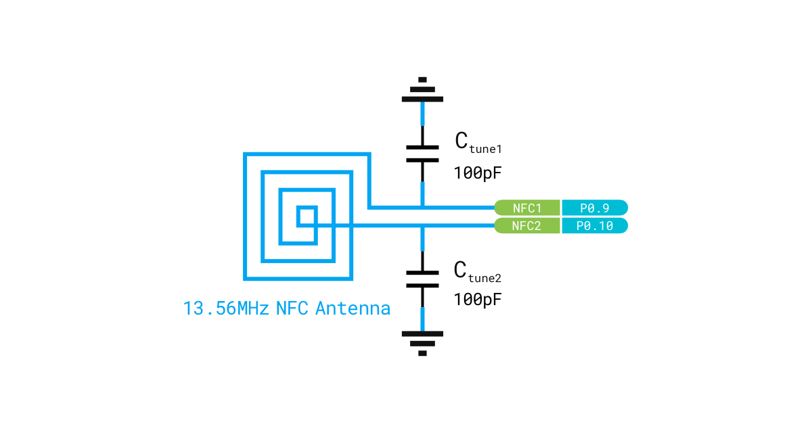

# Hardware description

This section of the documentation specifies and describes the nRF52840 MDK USB Dongle mainly from a hardware point of view.

## Hardware diagram

The following figure illustrates the nRF52840 MDK USB Dongle hardware diagram.

## Mechanical dimensions

nRF52840 MDK USB Dongle PCBA is a single sided 42mm x 17.78mm (1.65" x 0.7") 2.0mm thick PCB with a USB-A port and dual castellated/through-hole pins. nRF52840 MDK USB Dongle w/Case includes a high-quality plastic case in 50.8mm x 21.1mm (2.0" x 0.83") 7.6mm thick.

## Power supply

nRF52840 MDK USB Dongle can be powered by either the USB-A port or alternatively __VIN__ pin with input voltage range (3.3-5.5V). A High Efficiency Synchronous Step-Down Converter provides __3V3__ to the nRF52840 SoC and all other peripherals.

The following figure illustrates the power supply circuitry:

When USB power is applied the P-MOSFET will turn off and stop current flowing from __VIN__ to the converter, effectively disconnecting the external supplies. The converter will then use power from USB through the Schottky diode.

## General purpose I/Os

There are up to 12 multi-function General Purpose I/Os (4 can be used as ADC inputs) available on the edge pins. These GPIOs are powered from the on-board 3.3V rail, and should be used for 3.3V logic level. Any GPIO can be mapped to a digital peripheral (such as UART, SPI, TWI, PDM, I2S, QSPI, PWM and QDEC) for layout flexibility.

The following figure illustrates the GPIOs pinout:

## Button and LEDs

The dongle has one button and one RGB LED connected to dedicated GPIOs on the nRF52840 SoC, and a Green LED for USB power indicating (NOT assembled in w/Case option). The following table shows the Button and RGB LED connections:

| Part              | GPIO        | Active state |
|-------------------|-------------|--------------|
| USER/RESET Button | __`P0.18`__ | __`LOW`__    |
| RGB LED - Red     | __`P0.23`__ | __`LOW`__    |
| RGB LED - Green   | __`P0.22`__ | __`LOW`__    |
| RGB LED - Blue    | __`P0.24`__ | __`LOW`__    |

## 2.4GHz antenna

nRF52840 MDK USB Dongle integrates a small and high efficiency omni-directional 2.4GHz Chip antenna. The following figure shows the typical free space 2D radiation pattern of the Chip antenna:

## NFC antenna interface

nRF52840 MDK USB Dongle supports a Near Field Communication (NFC) tag. NFC uses two pins (__NFC1__ and __NFC2__) to connect the antenna. These pins are shared with GPIOs (__P0.09__ and __P0.10__).

An NFC antenna is a coil inductor, and together with capacitors to ground, they form a parallel resonant
LC tank. Since the active device operates at 13.56 MHz, the passive device antenna should also resonate at that frequency. 

The following figure shows the antenna and the parallel capacitors forming an LC tank circuit. The parallel capacitors, C~tune1~ and C~tune2~ are pre-mounted with 100pF capacitors.

## Debug interface

nRF52840 MDK USB Dongle supports Arm Serial Wire Debug (SWD) port, which makes it possible to connect external debuggers for debugging and programming. The I/O voltage of SWD should be 3.3V.

The following figure demonstrates how to connect an external debugger (for example, [Pitaya-Link debug probe]) for debugging:

The connections are listed in the table below:

| Pitaya-Link  | Wire                                                      | nRF52840 MDK USB Dongle |
|:------------:|:---------------------------------------------------------:|:-----------------------:|
| __`3V3`__    | :fontawesome-solid-arrow-right-long:{ .red-wire }         | __`VIN`__               |
| __`GND`__    | :fontawesome-solid-arrow-right-long:{ .gray-wire }        | __`GND`__               |
| __`RESET`__  | :fontawesome-solid-arrow-right-long:{ .amber-wire }       | __`RESET`__             |
| __`SWDCLK`__ | :fontawesome-solid-arrow-right-long:{ .light-green-wire } | __`SWDCLK`__            |
| __`SWDIO`__  | :fontawesome-solid-arrows-left-right:{ .light-blue-wire } | __`SWDIO`__             |

[Pitaya-Link debug probe]: https://makerdiary.com/products/pitaya-link