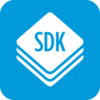

# nRF5 SDK <br><small>Offical Software Development Kit for nRF51 and nRF52 Series</small>

[](http://www.nordicsemi.com/eng/Products/Bluetooth-low-energy/nRF5-SDK)

## Introduction

The nRF5 SDK provides a rich developing environment for nRF5 Series devices by including a broad selection of drivers, libraries, examples for peripherals, SoftDevices, and proprietary radio protocols.

The SDK is delivered as a plain .zip-archive, which makes it easy to install as well as giving you the freedom to choose the IDE and compiler of your choice.

We provide example applications that you can run on your nRF52840-MDK to ensure that everything is set up correctly. After these tests, you can use the examples as starting point to develop your own applications.

Before we begin, we need to install some software components to build our example applications. 

## Set Up the Development Environment

Use the following procedure to create a new development environment:

* [Setting up the nRF5 SDK Development Environment](https://wiki.makerdiary.com/nrf52840-mdk/nrf5-sdk/)


## Compiling and running blinky example

Next, you can try to build one of the examples. Will use the `blinky` example here to keep it simple.

Open terminal, change directory and the compile the example:

``` sh
$ cd ./nrf52840-mdk-usb-dongle/examples/nrf5-sdk/blinky/armgcc/
$ make
```

While holding the dongle's RESET/USR button, connect it to your computer. When the Dongle has entered the bootloader mode, the RGB LED pulses RED. The Dongle is now ready for programming.

!!! note 
	For programming, just follow the "[Programming](programming.md)" section.

After programmed correctly, observe that the LEDs are blinking:


## Running examples that use a SoftDevice

Before you can run more advanced examples that use *Bluetooth* or *ANT*, you must program the SoftDevice on the board.

The SoftDevice binary is located in folder `components/softdevice/<SoftDevice>/hex` in the SDK, where `<SoftDevice>` is the name of the SoftDevice. You can also download SoftDevices from [nordicsemi.com](https://www.nordicsemi.com/eng/Products/nRF52840).

1. Open a command prompt in the folder that contains the makefile of an example. The example must require a SoftDevice. For example, the `ble_app_blinky` example.

	``` sh
	# change to the armgcc directory of 'ble_app_blinky' example
	$ cd ~/nrf52840-mdk-usb-dongle/examples/nrf5-sdk/ble_app_blinky/armgcc
	```

2. Compile the application:

	``` sh
	$ make clean & make
	```

3. Follow the [Programming](programming.md) guide to program the Application and SoftDevice separately
.

4. Open nRF Connect App and start scanning, a device called *nRF52840-MDK-Dongle* will be found! You can try to connect it and turn on/off the LED.


## More examples

Over time, more example applications will be added to the repository. You can star or watch the [nrf52840-mdk-usb-dongle](https://github.com/makerdiary/nrf52840-mdk-usb-dongle) repository to stay up to date.

## Reference

* [Nordic nRF5 SDK](http://infocenter.nordicsemi.com/topic/com.nordic.infocenter.sdk/dita/sdk/nrf5_sdk.html)

* [Nordic Semiconductor Infocenter](http://infocenter.nordicsemi.com/index.jsp)

* [makerdiary/nrf52840-mdk-usb-dongle](https://github.com/makerdiary/nrf52840-mdk-usb-dongle)

## License
Content on this page is licensed under the [Creative Commons Attribution 3.0 License](https://creativecommons.org/licenses/by/3.0/).

## Create an Issue

Interested in contributing to this project? Want to report a bug? Feel free and click here:

<a href="https://github.com/makerdiary/nrf52840-mdk-usb-dongle/issues/new"><button data-md-color-primary="red-bud"><i class="fa fa-github"></i> Create an Issue</button></a>
