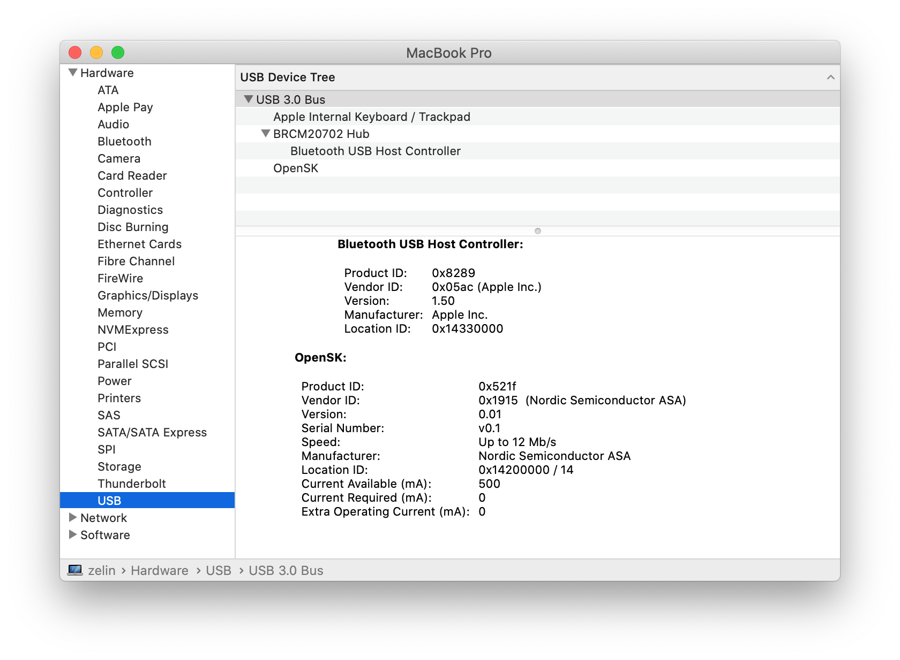

# How to build OpenSK

## Introduction

This section demonstrates how to set up your development environment, build the OpenSK and prepare a working OpenSK firmware.

For a more detailed guide, please refer to Google's [installation guide](https://github.com/google/OpenSK/blob/master/docs/install.md).

## Clone OpenSK repository

Clone the OpenSK repository with the nRF52840 MDK USB Dongle supported:

``` sh
git clone https://github.com/makerdiary/OpenSK
```

## Install Rust

OpenSK needs Rust installed on your system. For the moment the official way to install Rust is using [Rustup](https://rustup.rs/).

Run the following in your terminal, then follow the onscreen instructions.

``` sh
curl --proto '=https' --tlsv1.2 -sSf https://sh.rustup.rs | sh
```

## Setup OpenSK

Run the following script in the OpenSK repository for initial setup :

``` sh
./setup.sh
```

## Build the Tock OS

Run the following script to compile the Tock OS:

``` sh
board=nrf52840_mdk_usb_dongle ./deploy.sh os
```

The Tock OS firmware is located in `third_party/tock/boards/nordic/nrf52840_mdk_usb_dongle/target/thumbv7em-none-eabi/release/` with the `.hex`-format.

## Build OpenSK application

Run the following script to compile the OpenSK application:

``` sh
board=nrf52840_mdk_usb_dongle ./deploy.sh app
```

The app firmware contains `padding.bin` and `cortex-m4.tbf` which is located in `target/tab/`.

## Prepare OpenSK firmware

A working OpenSK firmware contains three parts: `tock-os.hex`, `padding.bin` and `cortex-m4.tbf`. 
[IntelHex]() can be used to convert and merge the firmware.

To convert `.bin` to `.hex` file:
``` sh
python bin2hex.py --offset=0x30000 padding.bin padding.hex
```

``` sh
python bin2hex.py --offset=0x40000 cortex-m4.tbf cortex-m4.hex
```

To merge the `.hex` files:
``` sh
python hexmerge.py -o opensk_all_in_one.hex tock-os.hex padding.hex cortex-m4.hex
```

To create a UF2 image for UF2 Bootloader from a `.hex` file:
``` sh
python uf2conv.py -c -f 0xada52840 -o opensk_all_in_one.uf2 opensk_all_in_one.hex
```

!!! tip
	The `uf2conv.py` conversion script is located in [nrf52840-mdk-usb-dongle/tools](https://github.com/makerdiary/nrf52840-mdk-usb-dongle/tree/master/tools).

## Flash OpenSK via UF2 Bootloader

Enter DFU mode by holding the dongle's RESET/USR button and connecting to your PC. A flash drive with the name **MDK-DONGLE** will appear.

Copy `opensk_all_in_one.uf2` image to **MDK-DONGLE**. 

When programming is completed, the OpenSK will run automatically. The device named **OpenSK** will detected by the computer.



## Reference

* [Google/OpenSK](https://github.com/google/OpenSK)
* [makerdiary/OpenSK](https://github.com/makerdiary/OpenSK)
* [Python IntelHex library](https://python-intelhex.readthedocs.io/en/stable/part1.html)

## License
Content on this page is licensed under the [Creative Commons Attribution 3.0 License](https://creativecommons.org/licenses/by/3.0/).

## Create an Issue

Interested in contributing to this project? Want to report a bug? Feel free to click here:

<a href="https://github.com/makerdiary/nrf52840-mdk-usb-dongle/issues/new"><button data-md-color-primary="red-bud"><i class="fa fa-github"></i> Create an Issue</button></a>


