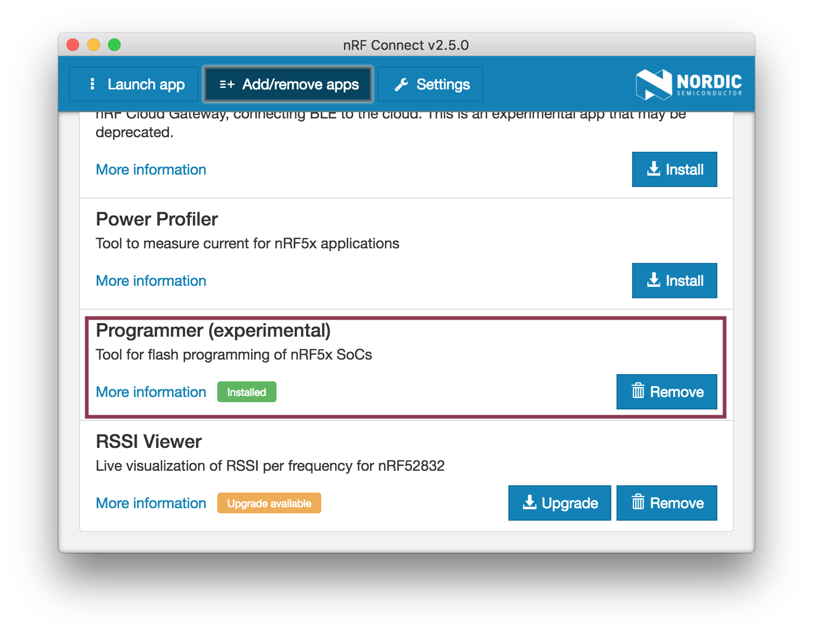
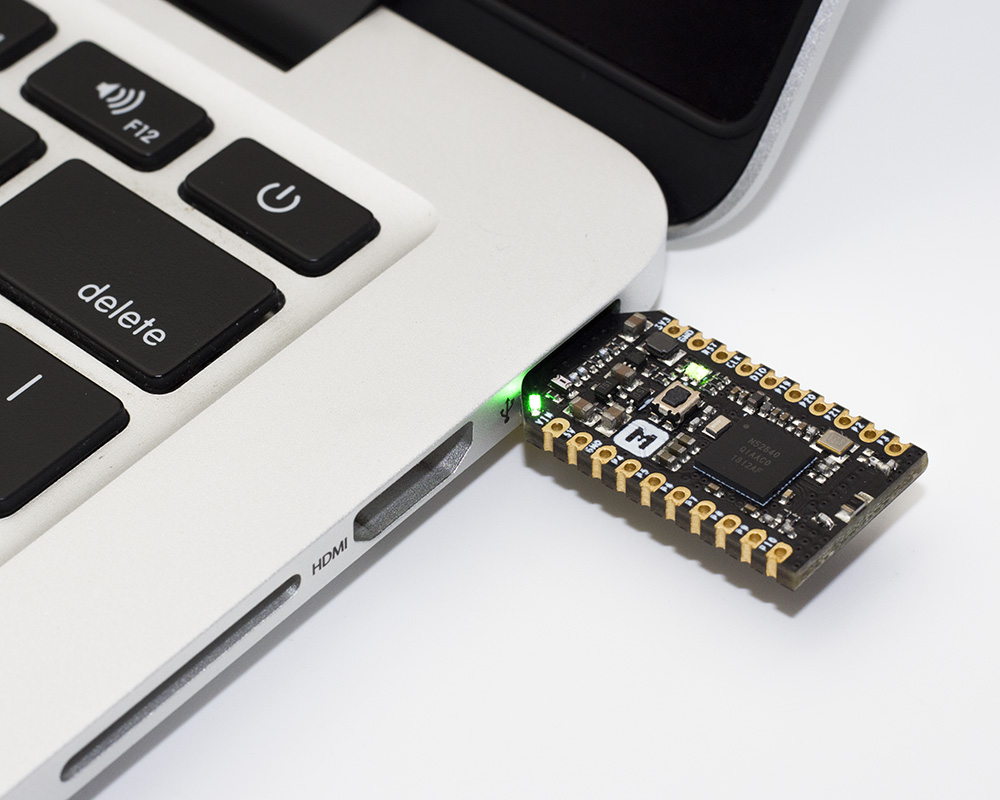
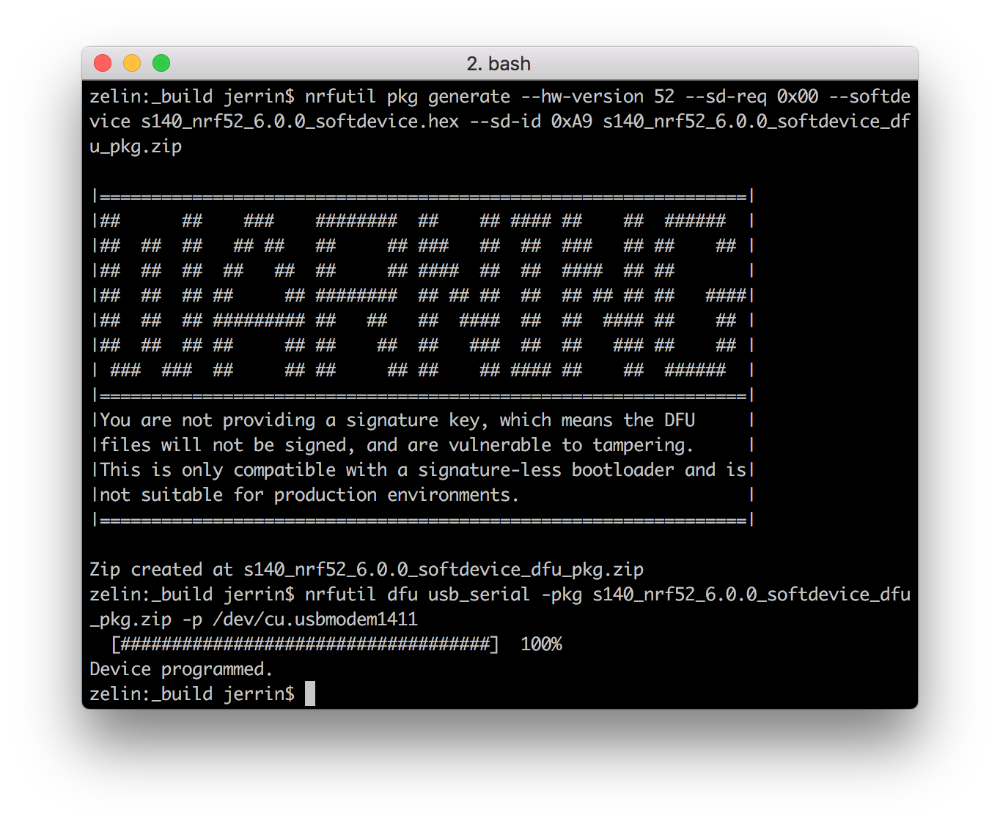

#How to program the nRF52840 MDK USB Dongle

The nRF52840 MDK USB Dongle contains an Open Bootloader with Device Firmware Update (DFU) functionality. You can easily program the Dongle using the following tools:

* [nRF Connet for Desktop](https://www.nordicsemi.com/eng/Products/Bluetooth-low-energy/nRF-Connect-for-Desktop)
* [nrfutil](https://github.com/NordicSemiconductor/pc-nrfutil/) from the command line.

## Using nRF Connect for Desktop

nRF Connect for Desktop contains a programmer app called [*nRF Connect Programmer*](https://github.com/NordicSemiconductor/pc-nrfconnect-programmer). It is a cross-platform tool that enables programming firmwares to device. Memory layout for Nordic USB devices can be displayed. Content for the HEX files can be displayed, too. Moreover, content of HEX files can be written to the devices.

### Installation

To install the application you can download binaries from the [nRF Connect product page](https://www.nordicsemi.com/eng/Products/Bluetooth-low-energy/nRF-Connect-for-Desktop) on Nordic Semiconductor web pages.

nRF Connect currently supports the following operating systems:

* Windows
* Ubuntu Linux 64-bit
* macOS

After nRF Connect is installed, you can find Programmer in the app list by selecting **Add/remove apps**.



### Programming Application

To program the Dongle, it must be in bootloader mode.

While holding the dongle's RESET/USR button, connect it to your computer. When the Dongle has entered the bootloader mode, the RGB LED pulses RED. The Dongle is now ready for programming.

Launch *Programmer* app from nRF Connect, you can find the dongle and select it to start programming.


Add an application `.hex` file, you will see the memory layout of the HEX file. Make sure the application address starts from `0x00001000`, and then Write it into the Dongle:

<a href="https://github.com/makerdiary/nrf52840-mdk-usb-dongle/tree/master/examples/nrf5-sdk/blinky/hex"><button data-md-color-primary="red-bud">Blinky Hex File</button></a>

!!! warning
	You MUST provide a correct application firmware without covering the Master Boot Record(MBR) and Bootloader. That is to say the application address should start from `0x00001000` and not exceed `0x000E0000`.


After programming, please physically reset the Dongle by re-plugging it. The new firmware should work as expected.



### Programming SoftDevice

If you want to run your application with BLE/ANT, a SoftDevice is required before programming the application. 

Select a SoftDevice `.hex` file from `<nRF5 SDK>/components/softdevice/s140/hex`, and then write it into the Dongle:


## Using nrfutil

[nrfutil](https://github.com/NordicSemiconductor/pc-nrfutil) is a Python package and command-line utility that supports Device Firmware Updates (DFU) and cryptographic functionality.

The nrfutil application and its library offer the following features:

* DFU package generation
* Cryptographic key generation, management, and storage
* Bootloader settings generation
* DFU procedure over any of the following transports:
  	- Bluetooth Low Energy
	- Serial over UART
	- Serial over USB
	- Thread unicast
	- Thread multicast

Here is the latest user guide from Nordic Semiconductor:

<a href="http://infocenter.nordicsemi.com/pdf/nrfutil_v1.3.pdf"><button data-md-color-primary="red-bud">nrfutil User Guide v1.3</button></a>

### Installing from PyPI

To install the latest published version from the Python Package Index simply type:

``` sh
pip install nrfutil
```

### Updating Application

Generate a package (.zip file) that you can later use to update. This command takes several options that you can list using:

``` sh
nrfutil pkg generate --help
```

Below is an example of the generation of a package from an application's `app.hex` file:

``` sh
nrfutil pkg generate --hw-version 52 --sd-req 0x00 --application-version 1 --application app.hex  app_dfu_package.zip
```

There is no SoftDevice required here, just set `--sd-req` to `0x00`.

!!! tip
    See the [nrfutil User Guide](http://infocenter.nordicsemi.com/pdf/nrfutil_v1.3.pdf) for more commands details.

Here we take the [blinky example](https://github.com/makerdiary/nrf52840-mdk-usb-dongle/tree/master/examples/nrf5-sdk/blinky/hex) as an example:


To update the firmware, the Dongle must be in bootloader mode.

While holding the dongle's RESET/USR button, connect it to your host. When the Dongle has entered the bootloader mode, the RGB LED pulses RED. It is now ready for programming.

This command takes several options that you can list using:

``` sh
nrfutil dfu usb-serial --help
```

Below is the execution of a DFU procedure of the file generated above over `/dev/cu.usbmodem1411`:

``` sh
nrfutil dfu usb-serial -pkg dfu_blinky.zip -p /dev/cu.usbmodem1411
```


The new application firmware should work as expected after Device programmed.

### Updating SoftDevice

If you want to run your application with BLE/ANT, a SoftDevice is required before programming the application. 

Here is an example for the generation of a package from a SoftDevice `.hex` file:

``` sh
nrfutil pkg generate --hw-version 52 --sd-req 0x00 --softdevice s140_nrf52_6.0.0_softdevice.hex --sd-id 0xA9 s140_nrf52_6.0.0_softdevice_dfu_pkg.zip
```

Then update the package using the following command:

``` sh
nrfutil dfu usb-serial -pkg s140_nrf52_6.0.0_softdevice_dfu_pkg.zip -p /dev/cu.usbmodem1411
```




## License
Content on this page is licensed under the [Creative Commons Attribution 3.0 License](https://creativecommons.org/licenses/by/3.0/).


## Create an Issue

Interested in contributing to this project? Want to report a bug? Feel free to click here:

<a href="https://github.com/makerdiary/nrf52840-mdk-usb-dongle/issues/new"><button data-md-color-primary="red-bud"><i class="fa fa-github"></i> Create an Issue</button></a>

