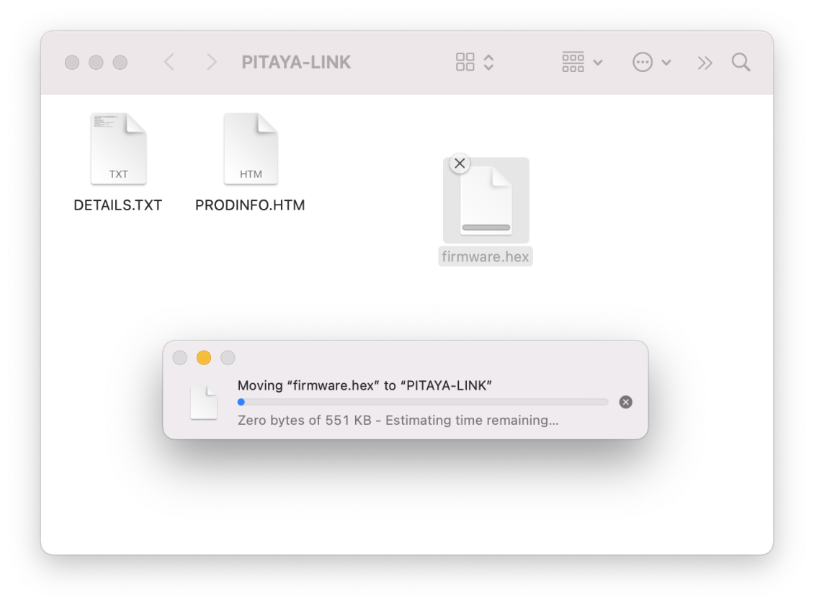

# Using Pitaya-Link Debug Probe

Pitaya-Link is a low-cost debug probe based on the CMSIS-DAP (also known as DAPLink) protocol standard. It can be used to program and debug the application software running on Arm Cortex Microcontrollers.

This section details how to program the nRF52840 MDK USB Dongle using Pitaya-Link debug probe. Refer to the [Pitaya-Link User's Guide](https://wiki.makerdiary.com/pitaya-link/) for more details.

## Requirements

Before you start, check that you have the required hardware and software:

- 1x [nRF52840 MDK USB Dongle](https://makerdiary.com/products/nrf52840-mdk-usb-dongle)
- 1x [Pitaya-Link Debug Probe](https://makerdiary.com/products/pitaya-link)
- 1x USB-C Cable
- Several jumper wires
- A computer running macOS, Linux, or Windows 7 or newer
- [Python](https://www.python.org/downloads/) 3.6.0 or later
- [pyOCD](https://github.com/pyocd/pyOCD) - Python based tool and API for debugging, programming, and exploring Arm Cortex microcontrollers.

## Installing pyOCD

The latest stable version of pyOCD may be installed via [pip](https://pip.pypa.io/en/stable/index.html). Open up a terminal and run:

=== "Windows"

    ``` bash linenums="1"
    py -3 -m pip install -U pyocd
    ```

=== "Linux/macOS"

    ``` bash linenums="1"
    python3 -m pip install -U pyocd
    ```

## Wiring the boards

Perform the following steps to connect the boards:

1. Connect Pitaya-Link to the target board using the jumper wires.
2. Connect Pitaya-Link to the PC using the USB-C Cable.


The following table shows the signals between Pitaya-Link and nRF52840 MDK USB Dongle:

| Pitaya-Link  | Wire                                                      | nRF52840 MDK USB Dongle |
|:------------:|:---------------------------------------------------------:|:-----------------------:|
| __`3V3`__    | :fontawesome-solid-arrow-right-long:{ .red-wire }         | __`VSYS`__              |
| __`GND`__    | :fontawesome-solid-arrow-right-long:{ .gray-wire }        | __`GND`__               |
| __`RESET`__  | :fontawesome-solid-arrow-right-long:{ .amber-wire }       | __`RESET`__             |
| __`SWDCLK`__ | :fontawesome-solid-arrow-right-long:{ .light-green-wire } | __`SWDCLK`__            |
| __`SWDIO`__  | :fontawesome-solid-arrows-left-right:{ .light-blue-wire } | __`SWDIO`__             |

## Drag-and-drop programming

Drag-and-drop is an optional intuitive programming feature of DAPLink. It allows programming of your target microcontroller in a very simple way: dragging and dropping a file (`.hex`-format) onto the __PITAYA-LINK__ drive.



## Using pyOCD

The `pyocd` command line tool gives you total control over your device with these subcommands:

- `gdbserver`: GDB remote server allows you to debug using gdb via either the console or [several GUI debugger options](https://pyocd.io/docs/gdb_setup).
- `load`: Program files of various formats into flash or RAM.
- `erase`: Erase part or all of an MCU's flash memory.
- `pack`: Manage [CMSIS Device Family Packs](https://open-cmsis-pack.github.io/Open-CMSIS-Pack-Spec/main/html/index.html) that provide additional target device support.
- `commander`: Interactive REPL control and inspection of the MCU.
- `server`: Share a debug probe with a TCP/IP server.
- `reset`: Hardware or software reset of a device.
- `rtt`: Stream Segger RTT IO with any debug probe.
- `list`: Show connected devices.

You can get additional help by adding `--help` option.

To load/erase the nRF52840 MDK USB Dongle target, open up a terminal and run:

=== "Load `.hex`"

    ``` bash linenums="1"
    pyocd load -t nrf52840 firmware.hex
    ```

=== "Load `.bin`"

    ``` bash linenums="1"
    pyocd load -t nrf52840 --base-address 0x1000 firmware.bin
    ```

=== "Chip Erase"

    ``` bash linenums="1"
    pyocd erase -t nrf52840 --chip
    ```
