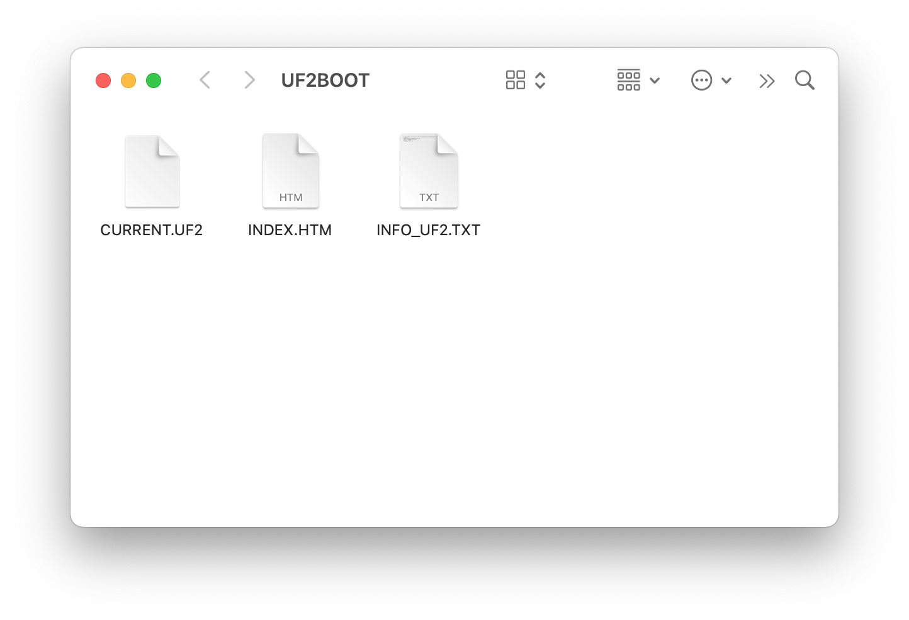

# Update firmware using the UF2 Bootloader

## Overview

nRF52840 MDK USB Dongle is shipped with the UF2 Bootloader, which is an easy-to-use and self-upgradable bootloader that can be used to update the firmware by just copying the `.uf2`-format images to the flash drive without using an external programmer.

This section details how to update firmware using the UF2 Bootloader.

!!! Warning "UF2 Bootloader Update Notification"
    The dongle manufactured after July 20 2023 is shipped with the latest [UF2 Bootloader 0.7.1](https://github.com/makerdiary/nrf52840-mdk-usb-dongle/tree/main/firmware/uf2_bootloader/0.7.1). You may get a dongle without the latest bootloader, and if you would like to explore new features of the latest bootloader, just follow the [Updating the UF2 Bootloader](#updating-the-uf2-bootloader) section.

## Flash memory layout

When updating firmware using the UF2 Bootloader, you must be aware of where in the device memory the different firmware components are located.

The following figure shows the default flash memory layout of nRF52840 MDK USB Dongle:

| Usage                    | Memory location | Size   |
|--------------------------|-----------------|--------|
| Bootloader settings      | 0x000FF000      | 4 KB   |
| MBR parameter storage    | 0x000FE000      | 4 KB   |
| Bootloader config        | 0x000FD800      | 2 KB   |
| Bootloader               | 0x000F4000      | 38 KB  |
| Application              | 0x00001000      | 972 KB |
| Master Boot Record (MBR) | 0x00000000      | 4 KB   |

## Installing UF2 Converter

`uf2conv` is an open source Python based tool for packing and unpacking [UF2](https://github.com/microsoft/uf2) files.

Before you install `uf2conv`, make sure that you have Python 3.6.0 or later installed. 

Then open up a terminal and run the following command to install the latest prerelease version from the HEAD of the main branch:

=== "Windows"

    ``` bash linenums="1"
    py -3 -m pip install --pre -U git+https://github.com/makerdiary/uf2utils.git@main
    ```

=== "Linux/macOS"

    ``` bash linenums="1"
    python3 -m pip install --pre -U git+https://github.com/makerdiary/uf2utils.git@main
    ```

You can run `uf2conv --help` for a list of available options:

``` { .bash .no-copy linenums="1" }
$ uf2conv --help

usage: uf2conv [-h] [-b BASE] [-f FAMILY] [-o FILE] [-d DEVICE_PATH] [-l] [-c] [-D] [-w] [-C] [-i] [INPUT]

Convert to UF2 or flash directly.

positional arguments:
  INPUT                 input file (HEX, BIN or UF2)

options:
  -h, --help            show this help message and exit
  -b BASE, --base BASE  set base address of application for BIN format (default: 0x2000)
  -f FAMILY, --family FAMILY
                        specify familyID - number or name (default: 0x0)
  -o FILE, --output FILE
                        write output to named file; defaults to "flash.uf2" or "flash.bin" where sensible
  -d DEVICE_PATH, --device DEVICE_PATH
                        select a device path to flash
  -l, --list            list connected devices
  -c, --convert         do not flash, just convert
  -D, --deploy          just flash, do not convert
  -w, --wait            wait for device to flash
  -C, --carray          convert binary file to a C array, not UF2
  -i, --info            display header information from UF2, do not convert

```

## Generating the firmware in UF2

To generate the application firmware in UF2, simply use `uf2conv` on a `.bin` file or `.hex` file, specifying the family as `0xADA52840`:

=== "Generating from `.hex`"

    ``` bash linenums="1"
    uf2conv -f 0xADA52840 -c -o application.uf2 application.hex
    ```

=== "Generating from `.bin`"

    ``` bash linenums="1"
    uf2conv -f 0xADA52840 -c -b 0x1000 -o application.uf2 application.bin
    ```

To generate a UF2 image for bootloader from a `.hex` file, specifying the separated family of `0xD663823C`:

``` bash linenums="1"
uf2conv -f 0xD663823C -c -o bootloader.uf2 bootloader.hex
```

## Updating the application firmware

Generate the correct UF2 application firmware for your dongle by following [the steps above](#generating-the-firmware-in-uf2).

To update the application firmware, complete the following steps:

1. Push and hold the button and plug your dongle into the USB port of your computer. Release the button after your dongle is connected. The RGB LED turns green.

2. It will mount as a Mass Storage Device called __UF2BOOT__.

    

3. Drag and drop the UF2 file onto the __UF2BOOT__ volume. The RGB LED blinks red fast during flashing.

4. Re-plug the dongle and the new application firmware is running.

!!! tip "Double-Reset to enter DFU mode"
    If the button has been programmed as RESET functionality, reset twice within 500 ms will enter DFU with UF2 and CDC support.

## Updating the UF2 Bootloader

The UF2 Bootloader can be upgraded by using a newer UF2 Bootloader with the name `update-uf2_bootloader-nrf52840_mdk_usb_dongle-<version>-nosd.uf2`. This is the fastest and safest way to update bootloader. However, it requires your existing bootloader is at least __0.4.0__. If not, follow [Flashing UF2 Bootloader using an external debugger](#installing-uf2-bootloader-using-an-external-debugger) section.

To update the bootloader using UF2, complete the following steps:

1. Push and hold the button and plug your dongle into the USB port of your computer. Release the button after your dongle is connected. The RGB LED turns green.

2. Open `INFO_UF2.TXT` in the __UF2BOOT__ volume with a text editor, and check the current version of bootloader. It should be __0.4.0__ or newer. The figure below shows we are running the `0.7.1` version.

    

3. Check if newer updates are available in the [`firmware/uf2_bootloader`](https://github.com/makerdiary/nrf52840-mdk-usb-dongle/tree/main/firmware/uf2_bootloader) folder. The update is released with the name `update-uf2_bootloader-nrf52840_mdk_usb_dongle-<version>-nosd.uf2`.

4. Drag and drop the update file onto the __UF2BOOT__ volume.

5. Enter DFU mode again and verify the version printed in `INFO_UF2.TXT`.

## Installing UF2 Bootloader using an external debugger

You can always install a fresh `.hex`-format bootloader using an external debugger if your existing bootloader is out-of-date or gets corrupted somehow. The `.hex`-format bootloader is located in the [`firmware/uf2_bootloader`](https://github.com/makerdiary/nrf52840-mdk-usb-dongle/tree/main/firmware/uf2_bootloader) folder. Follow the instructions below for programming:
    
* [Using DAPLink Firmware](./daplink.md)
* [Using Pitaya-Link Debug Probe](./pitaya-link.md)
