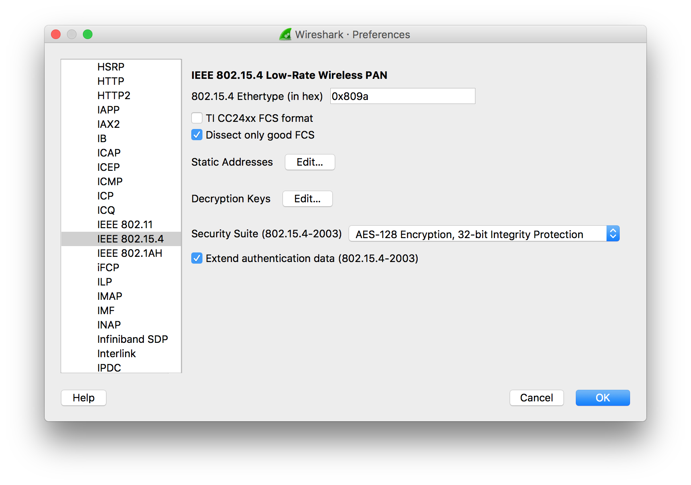

# Build a Thread Network Sniffer with Wireshark

This guide details how to set up a Thread Sniffer, which can help you to efficiently analyze Thread network traffic.

During development, you may need to check what kind of data is wirelessly transmitted over the Thread network. With the help of the following instructions, you can set up a sniffer which allows to dynamically monitor the IEEE 802.15.4 wireless traffic. The captured frames are passed to Wireshark which allows to decode the Thread protocol and other protocols that it uses like 6LoWPAN, IPv6, UDP, CoAP, providing complete information about the messages that are sent in the mesh network.


## What you'll need

* nRF52840 MDK USB Dongle
* PC running a Linux based operating system or MacOS
* Wireshark 2.4.1 or newer
* Python 2.7.10

## Installing Wireshark

!!! tip "About Wireshark"
    **Wireshark** is the world’s foremost and widely-used network protocol analyzer. It lets you see what’s happening on your network at a microscopic level and is the de facto (and often de jure) standard across many commercial and non-profit enterprises, government agencies, and educational institutions.

On MacOS, go to the [Wireshark Download page](https://www.wireshark.org/#download) and download the current stable release of Wireshark.

On Ubuntu Linux, you can run the following commands:

``` sh
$ sudo add-apt-repository ppa:dreibh/ppa
$ sudo apt-get update
$ sudo apt-get install wireshark
```

## Connecting the USB Dongle

Connect the nRF52840 MDK USB Dongle to your host as shown below: 


The USB Dongle will be recognized as an nRF52840 OpenThread Device like this:


## Starting Wireshark with the Sniffer

At first, you must clone the [pyspinel repository](https://github.com/openthread/pyspinel.git) which will be used as an interface between NCP and Wireshark.

``` sh
$ git clone https://github.com/openthread/pyspinel.git
$ cd pyspinel
$ sudo pip install --user pyserial
$ sudo pip install --user ipaddress
```

Then start Wireshark with the following command:

``` sh
$ sudo python ./sniffer.py -c 11 -n 1 -b 115200 --crc -u /dev/cu.usbmodem1411 --no-reset | wireshark -k -i -
```

The parameters stand for the following: 

* *-c*: Thread Channel
* *-n*: Node ID 
* *–crc*: Disables the wrong FCS warning resulting from the fact that Nordic radio replaces one byte of CRC with LQI after a packet is received and verified. 
* *–no-reset*: Used when NCP is connected via the native USB connection, otherwise this parameter should be omitted.


Enter the menu **Wireshark** -> **Preferences**, and then go to **Protocols** -> **IEEE 802.15.4**.



Edit the Decryption Keys with the following values:

* Decryption key: `00112233445566778899aabbccddeeff`

* Decryption key index: `1`

* Key hash: `Thread hash`


Go to **Protocols** -> **Thread** and edit the settings.


Go to **Protocols** -> **6LoWPAN** and edit the settings.


Now you are ready to get the Thread packets and analyze network traffic.

!!! tip
    You can follow this guide to [Build a Thread network with nRF52840-MDK](https://wiki.makerdiary.com/nrf52840-mdk/openthread/) for testing.


## Reference

* [Thread Sniffer based on nRF52840 with Wireshark](http://infocenter.nordicsemi.com/topic/com.nordic.infocenter.thread_zigbee.v1.0.0/thread_sniffer.html)
* [pyspinel repository](https://github.com/openthread/pyspinel.git)
* [Wireshark Developer’s Guide](https://www.wireshark.org/docs/wsdg_html_chunked/)


## License
Content on this page is licensed under the [Creative Commons Attribution 3.0 License](https://creativecommons.org/licenses/by/3.0/).

## Create an Issue

Interested in contributing to this project? Want to report a bug? Feel free to click here:

<a href="https://github.com/makerdiary/nrf52840-mdk-usb-dongle/issues/new"><button data-md-color-primary="marsala"><i class="fa fa-github"></i> Create an Issue</button></a>

