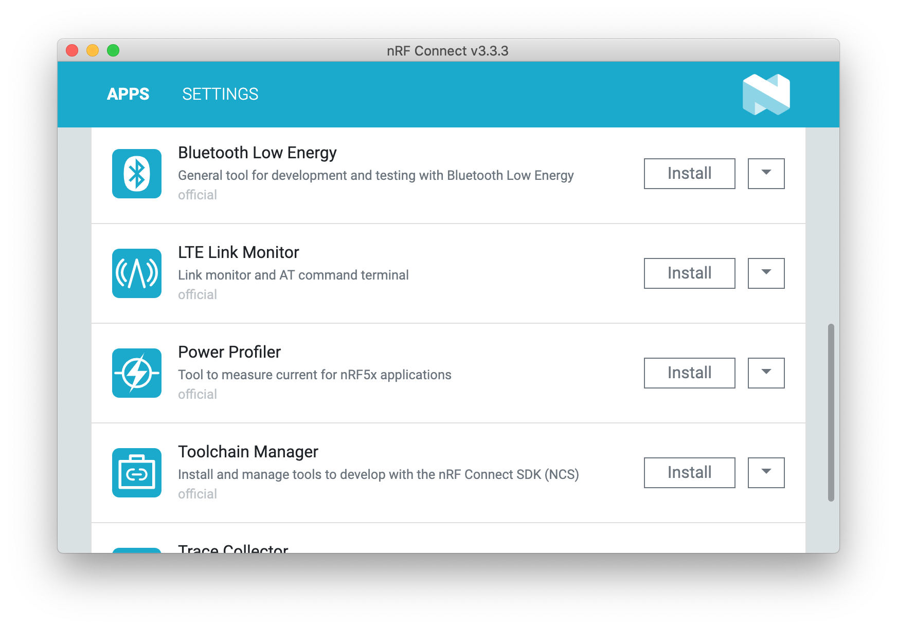
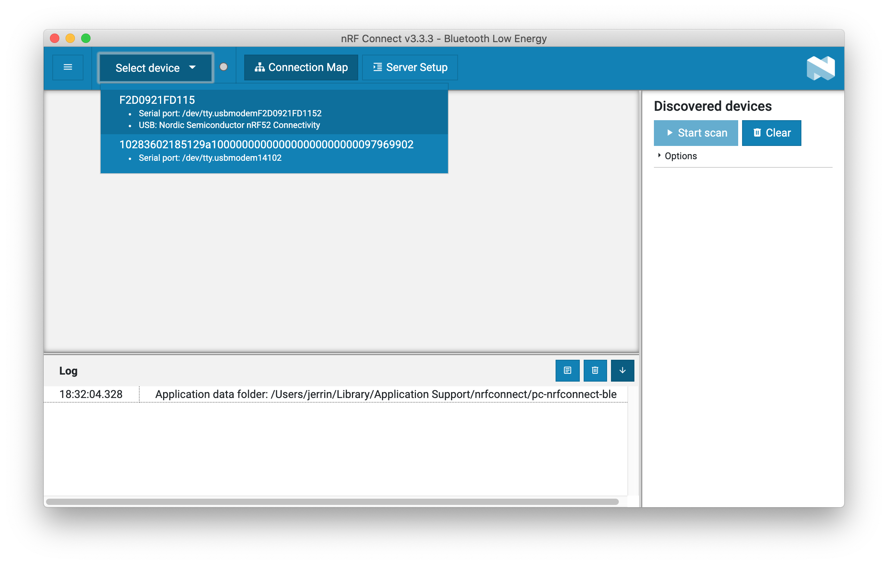
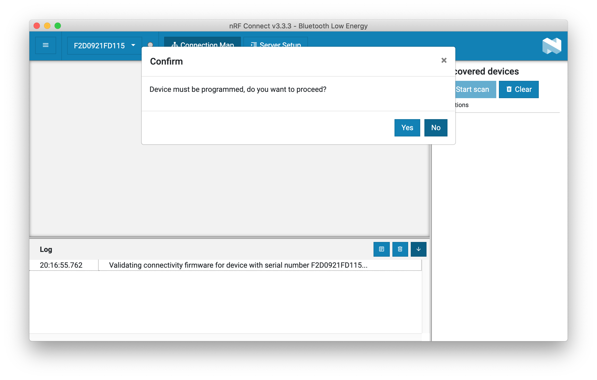
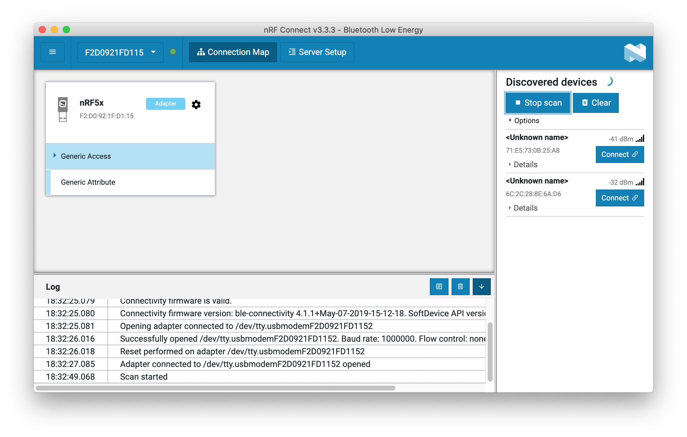

## Overview

This section details how to use the prebuilt BLE Connectivity firmware with nRF Connect Bluetooth Low Energy app.

> **nRF Connect Bluetooth® Low Energy** is an app for the nRF Connect desktop application for getting familiar with, developing, and testing Bluetooth Low Energy devices. It allows you to set up a local device, connect it to advertising devices and discover their services, maintain the connection and the connection parameters, pair the devices, and change the server setup for your local device. It also offers a detailed log for troubleshooting purposes.

## Programming the firmware

The prebuilt Connectivity firmware is located in this folder with the name `connectivity_4.1.2_usb_with_s132_5.1.0.uf2`.

Enter DFU mode by holding the dongle's RESET/USR button and connecting to your PC. A flash drive with the name **MDK-DONGLE** will appear.

Copy the firmware `connectivity_4.1.2_usb_with_s132_5.1.0.uf2` to **MDK-DONGLE**. 

When programming is completed, re-plug the dongle. The device named **nRF52 Connectivity** will detected by the computer.

## Testing

1. Start **nRF Connect** desktop application and install the **Bluetooth Low Energy** app:

	

2. Connect the dongle to your PC, open **Bluetooth Low Energy** app and select the dongle's serial port:

	

3. If the app brings up the following message, click **NO**(as we have programmed the device previously).

	

4. Try to scan the BLE devices nearby and expore more features of the app:

	

