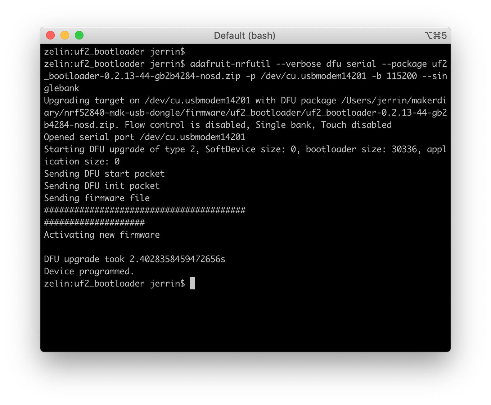

## DFU via UF2 Bootloader

UF2 Bootloader is an easy-to-use bootloader that appears as a flash drive. You can just copy `.uf2`-format application images to the flash drive to load new firmware. This folder contains the prebuilt UF2 Bootloader firmware.

To create your own UF2 DFU update image, simply use the [Python conversion script](https://github.com/makerdiary/nrf52840-mdk-usb-dongle/tree/master/tools) on a `.bin` file or `.hex` file, specifying the family as `0xADA52840`.

If using a `.bin` file with the conversion script you must specify application address with the `-b` switch, this address depend on the SoftDevice size/version e.g S140 v6 is `0x26000`.

To create a UF2 image from a .bin file:
``` sh
uf2conv.py firmware.bin -c -b 0x26000 -f 0xADA52840
```

To create a UF2 image from a .hex file:
``` sh
uf2conv.py firmware.hex -c -f 0xADA52840
```

Enter DFU mode by holding the dongle's RESET/USR button and connecting to your PC. A flash drive with the name **MDK-DONGLE** will appear.

Just copy the `.uf2`-format image to the flash drive the to load new firmware. 

## Update UF2 Bootloader

The UF2 Bootloader is self-upgradable. An update ensures you have the most recent features and improvements for your current version of UF2 Bootloader. 

To update UF2 Bootloader, [adafruit-nrfutil](https://github.com/adafruit/Adafruit_nRF52_nrfutil) is needed. Run the following command to install `adafruit-nrfutil` from Adafruit's GitHub repository (Version had to be locked due to updates done to the util since this was written):

``` sh
pip3 install https://github.com/adafruit/Adafruit_nRF52_nrfutil/archive/474a584a97590f0fe928f1633596f809b4ab1297.zip
```

Here is an example of the generation of a package from a `.hex` bootloader file:

``` sh
adafruit-nrfutil dfu genpkg --dev-type 0x0052 --dev-revision 52840 --bootloader uf2_bootloader-0.2.13-44-gb2b4284-nosd.hex uf2_bootloader-0.2.13-44-gb2b4284-nosd.zip
```

Enter DFU mode by holding the dongle's RESET/USR button and connecting to your PC. Use the following command to update UF2 Bootloader:

``` sh
adafruit-nrfutil --verbose dfu serial --package uf2_bootloader-0.2.13-44-gb2b4284-nosd.zip -p <your-serial-port-name> -b 115200 --singlebank
```



